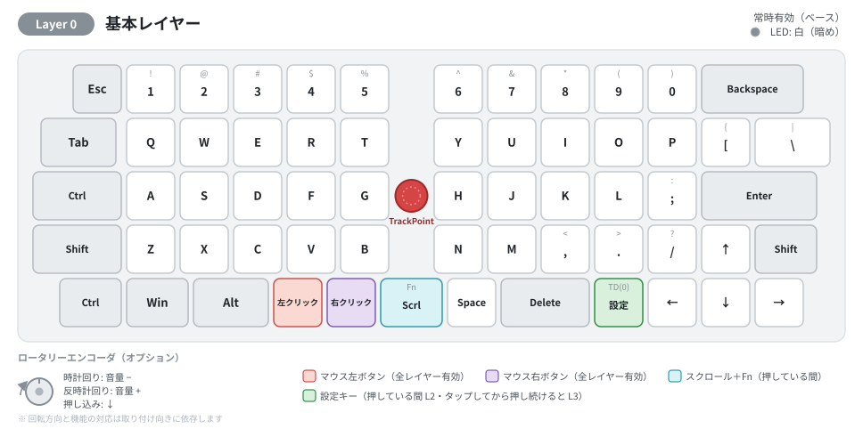

# OLSK60 v2
60% OrthoLinear Keyboard w/ TrackPoint – Designed for Standard Keycap Compatibility

> **この説明はファームウェア v3.0.0 以降向けです。**
> 旧版（v2.x）をお使いの方は、[v2.0.3 時点の説明](https://github.com/techmech-keeb/OLSK60_v2/tree/v2.0.3)をご覧ください。

> **v3.0.0 の公開（2026年10月8日）より前に購入された方へ:** お手元のキーボードには旧版（v2.x）のファームウェアが書き込まれています。**[firmware/README.md](firmware/README.md) の手順で v3 に更新してください。**本リポジトリの説明は v3 を前提にしています。どちらが書き込まれているかわからない場合も、更新して問題ありません（キーボードに保存された設定は初期化されます）。

## 概要
OLSK60 v2は、標準的なキーキャップセットに対応した、60%サイズの格子配列キーボードです。  
トラックポイントを搭載しているため、マウス操作もこの一台で完結します。  
また、GH60互換ケースに対応しており、お好みのキーキャップやケースと自由に組み合わせて、自分だけのカスタマイズを楽しめます。  
見た目も使い心地も、あなた好みに仕上げてください。

> **モデルについて:** 現在販売中のモデルは **v2.1** です。出荷時は **5-Split Space** レイアウトで、同梱のトッププレートに付け替えることで 3-Split Space／6.25U Space にも変更できます。旧モデル **v2** は 3-Split Space および 6.25U Space のみに対応しています。
>
> **ファームウェア（v3）は、機能はどれも同じで、出荷時のキーマップ（プリセット）だけが 2 通り**あります。5-Split Space 用と 3-Split Space 用で、**お使いのトッププレートに合うプリセットを選べば、書き込んだあと調整なしで使えます**。どちらを書き込んでも動作し、キー配置は Vial でいつでも変更できます。

### 主な特徴
- 格子配列60キー
- トラックポイント搭載
- GH60互換ケース対応
- Vial 対応（キーボード定義はファームウェア内蔵）
- 5-Split Space レイアウトで出荷（他のスペース列は対応ファームウェアを書き込んで使用）
- ホットスワップスイッチソケット採用
- スタビライザー実装済み

### 仕様

| 項目 | 内容 |
|------|------|
| 配列 | 直交（格子）配列 60キー、60%サイズ |
| 接続 | USB Type-C |
| MCU | RP2040（UF2 形式でファームウェア書き込み） |
| キーマップ | 5レイヤー、設定ツール（Vial）で編集可能 |
| 同時押し | 6キーまで（標準的な USB キーボードと同じ） |
| ポインティングデバイス | トラックポイント（押し下げクリック対応、オートマウスレイヤー機能） |
| ロータリーエンコーダ | オプション（右上に取り付け可能） |
| LED インジケーター | 1個（レイヤー・設定状態を色で表示） |
| スイッチ | ホットスワップソケット（MX互換） |
| ケース | GH60 互換 |
| キーキャップ | 標準的なキーキャップセットに対応 |

### 出荷時のキー配列（レイヤー0）

レイヤー構成の詳細は[キーボード操作ガイド](docs/OLSK60_user_guide.md)をご参照ください。

## ドキュメント

> **初めての方へ:** キットを購入された方は、ビルドガイド → キーボード操作ガイド の順にお読みください。

- [ビルドガイド](docs/buildguide.md) — キットの組み立て手順
- [キーボード操作ガイド](docs/OLSK60_user_guide.md) — レイヤー構成・各機能の使い方
- [マウス機能操作マニュアル](docs/OLSK60_mouse_manual.md) — トラックポイントの速度を自分好みに調整する方法
- [FAQ（よくある質問）](docs/faq.md) — モデルの見分け方・設定ツールの選び方など
- [3Dデータ](cad/)
  - [トラックポイントカバー](cad/trackpoint-cover/) - カスタマイズ用のSTEP/STLファイル

## ファームウェア
コンパイル済みファームウェアおよび更新手順は [`firmware/README.md`](firmware/README.md) にて公開しています。

- v3 は **Vial 専用**です（Remap / VIA には対応していません）。
- ファームウェアの**機能は共通**です。ファイルが 2 つあるのは**出荷時のキーマップ（プリセット）の違い**だけで、`5split` / `3split` からお使いのスペース列に合う方を選ぶと、そのまま調整なしで使えます。
- **v3.0.0 の公開（2026年10月8日）より前に購入された方は、v3 に更新してください**（旧版 v2.x が書き込まれています）。

## 購入

| 販売先 | 販売形態 | リンク |
|--------|----------|--------|
| BOOTH | Techmech keys 直営オンラインショップ | [商品ページ](https://techmech.booth.pm/items/5896343) |
| 遊舎工房 | 委託販売（店頭 & オンライン） | [商品ページ](https://shop.yushakobo.jp/products/11324) |

商品に関するお問い合わせは、ご購入先を問わず **Techmech keys** までお願いいたします。

## ライセンス
このプロジェクトは[MITライセンス](LICENSE)の下で公開されています。
