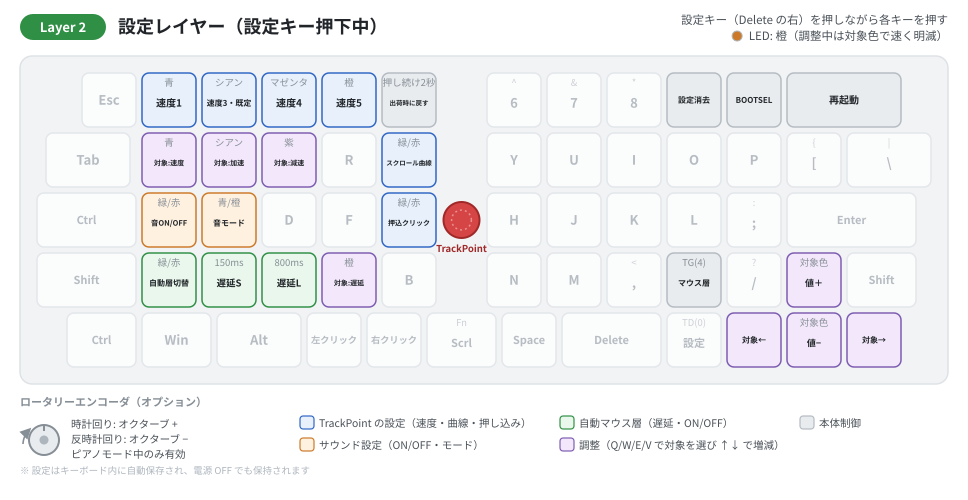

# OLSK60 マウス機能操作マニュアル

このドキュメントは、OLSK60 v2 のトラックポイント速度設定に関する詳細マニュアルです。トラックポイントの速度を自分好みに微調整したい方を対象としています。  
基本操作や他の機能については[キーボード操作ガイド](OLSK60_user_guide.md)をご参照ください。

> **本書が前提とするファームウェア:** **v3.0.0 以降**（Vial 対応・本リポジトリの[最新リリース](https://github.com/techmech-keeb/OLSK60_v2/releases/latest)）です。旧版（v2.x）をお使いの方は、[v2.0.3 時点の説明](https://github.com/techmech-keeb/OLSK60_v2/tree/v2.0.3)をご覧ください。

---

## クイックリファレンス

すべての操作はレイヤー2（最下段の**設定キー**＝ Delete の右を押しながら）で行います。

| キー | 機能 |
|------|------|
| 1 / 2 | 固定プロファイル切替（速度1 / 速度3） |
| 3 / 4 | 調整枠切替（速度4 / 速度5） |
| Q / W / E | 調整する対象を選ぶ（基本速度 / 加速度 / 減速度） |
| V | 調整する対象を選ぶ（オートレイヤーの解除時間） |
| ← / → | 調整する対象を順に切り替える |
| ↑ / ↓ | 選んだ対象の値を上げる / 下げる（基本速度・加速度・減速度は速度4・速度5 のときのみ） |
| Z | オートレイヤー ON/OFF |
| X / C | オートレイヤー解除時間（150ms / 800ms） |
| T | スクロールの効き方（強く操作するほど速い ⇄ 従来どおり） |
| G | 押し込みクリック ON/OFF |
| . | マウスレイヤーの手動 ON/OFF（TG(4)） |
| 5（2 秒押し続ける） | 出荷時の設定に戻す（キー配置はそのまま） |

---

## 目次

1. [トラックポイントの基本操作](#トラックポイントの基本操作)
2. [速度プロファイル](#速度プロファイル)
3. [調整枠の調整](#調整枠の調整)
4. [オートレイヤー](#オートレイヤー)
5. [LEDリファレンス](#ledリファレンス)
6. [設定の保存](#設定の保存)
7. [トラブルシューティング](#トラブルシューティング)

---

## トラックポイントの基本操作

### カーソル移動

トラックポイントを指先で軽く押すことでカーソルを移動できます。押す力の強さに応じてカーソルの移動速度が変化します。

### マウスボタン

最下段に配置された専用キーで操作します。マウス左ボタン・マウス右ボタンは**レイヤーに関係なく常時有効**です。

| 操作 | キー |
|------|------|
| 左クリック | マウス左ボタン（最下段。3-Split 版はマウスレイヤー側） |
| 右クリック | マウス右ボタン（最下段。3-Split 版はマウスレイヤー側） |

### スクロール

最下段の **Scrl キー**（左親指）を押しながらトラックポイントを動かすと、カーソル移動ではなくスクロール操作になります。押している間は Fn レイヤーも有効です。マウスレイヤーが出ているかどうかに関係なく使えます。

- 上下方向：ページの縦スクロール
- 左右方向：ページの横スクロール

**v3 ではスクロールが細かくなりました。**1 ノッチより小さい単位で送るため、ゆっくり動かしたときの追従が改善します。さらに、**軽く操作したときは細かく、強く操作するほど速く進む**調整が出荷時から有効です。

| 状態 | 切り替え | 動き |
|------|---------|------|
| ON（出荷時） | レイヤー2 + T（緑が2回点滅） | 操作の強さで 1 ノッチあたりの送り量が変わります |
| OFF | レイヤー2 + T（赤が2回点滅） | 操作の強さに比例した従来の動きに戻ります |

> ホスト側にもホイール加速がある環境では、二重に加速されて速すぎることがあります。そのときは OFF をお試しください。

### Depress機能（押し下げクリック）

トラックポイントを軽く押し下げることでクリック操作が可能です。出荷時は ON です。レイヤー2 + **G** で ON/OFF を切り替えられます（ON = 緑 / OFF = 赤が2回点滅。設定はキーボード内に保存されます）。

---

## 速度プロファイル

OLSK60 は 5 つの速度プロファイルを備えています。3 つの固定プロファイルと、ユーザーが自由に調整できる 2 つの調整枠です。

### プロファイル一覧

| # | プロファイル名 | 速度の目安 | 編集 |
|---|--------------|-----------|------|
| 1 | 速度1（遅い） | 低速（1x） — 細かい操作向け | 不可 |
| 2 | 速度2（中間） | 中速（2x） — 汎用 | 不可 |
| 3 | 速度3（速い）**※デフォルト** | 高速（約3.3x） — 広い画面向け | 不可 |
| 4 | 速度4（調整枠） | 初期値は速度1と同じ | 可能 |
| 5 | 速度5（調整枠） | 初期値は速度3と同じ | 可能 |

速度の倍率は速度1を基準（1x）とした目安です。調整枠は調整後の値がキーボード内に保存されます。

### プロファイルの切り替え

レイヤー2（設定キーを押しながら）で、数字キー1～4を押して切り替えます。

| キー | プロファイル | LED色 |
|------|-------------|-------|
| 1 | 速度1（遅い） | 青 |
| 2 | 速度3（速い） | シアン |
| 3 | 速度4（調整枠） | マゼンタ（赤紫） |
| 4 | 速度5（調整枠） | 橙 |

切り替え時、対応するプロファイル色でLEDが2回点滅します。速度2（中間）は設定レイヤーには置いていません。使いたい場合は、Vial で独自キー「TP Spd2」（色は紫）を好きな位置に割り当ててください。

### 3つのパラメータについて

| パラメータ | 効果 |
|-----------|------|
| 基本速度 | カーソル移動の全体的な速さ。大きいほど速い |
| 加速度 | トラックポイントを強く押した時の速度の増加率 |
| 減速度 | トラックポイントから力を抜いた時の速度の減衰率 |

---

## 調整枠の調整

速度4と速度5は、3つのパラメータを個別に調整できるプロファイルです。

> ⚠️ **重要:** 基本速度・加速度・減速度は、速度4 または速度5 を選択中のみ調整できます。速度1・速度3 を選択中は LED が**赤く速く3回**点滅し、操作は受け付けられません。上限・下限に達しているときは **黄色く速く3回**点滅します。

### 調整手順

1. レイヤー2で「3」（速度4）または「4」（速度5）を押し、調整枠を選択します（対応色でLEDが2回点滅）。
2. 設定キーを押したまま、調整したいパラメータを選びます。LED がその色で速く明滅します。

   | キー | 対象 | 明滅の色 |
   |------|------|---------|
   | Q | 基本速度 | 青 |
   | W | 加速度 | シアン |
   | E | 減速度 | 紫 |

   ← / → で順に切り替えることもできます。
3. **↑** で 1 段上げ（長めに1回光る）、**↓** で 1 段下げ（短く2回光る）ます。
4. 設定キーを離すと調整は終わります。値は自動保存されるので、そのまま使い始められます。

### 調整の範囲

各パラメータには上限と下限があり、限界値に達するとそれ以上の調整は反映されません（黄が速く3回点滅）。

| パラメータ | 下限から上限までのステップ数（目安） |
|-----------|----------------------------|
| 基本速度 | 約46ステップ |
| 加速度 | 約15ステップ |
| 減速度 | 約30ステップ |

基本速度は、速度1 のおよそ 8 倍（速度3 のおよそ 2.4 倍）まで上げられます。トラックポイントの反応が弱いと感じる場合は、速度5 を選んで基本速度を上げてください。ただし、速度を上げるほど、ゆっくり動かしたときの最小の移動量も大きくなります（細かい位置合わせはしにくくなります）。

### 使い方の例

2つの調整枠にそれぞれ異なるチューニングを保存し、作業に応じて切り替えて使えます。

- **速度4** → 画像編集やCADなど精密な操作用に、基本速度を低くし減速度を高めに設定
- **速度5** → マルチディスプレイ環境用に、基本速度と加速度を高めに設定

---

## オートレイヤー

トラックポイントを操作すると、自動的にレイヤー4（マウスレイヤー）に切り替わる機能です。詳しい動作の仕組みは[キーボード操作ガイドのオートレイヤーセクション](OLSK60_user_guide.md#オートレイヤー機能)をご参照ください。

### 解除タイミングの調整

レイヤー2で、トラックポイント操作停止後にマウスレイヤーが解除されるまでの時間を選べます。

| キー | 設定 | 遅延時間 | LED | 用途 |
|------|------|---------|-----|------|
| X | 短い | 150ms | 橙が1回点滅 | キー入力を優先したい場合 |
| C | 長い **※デフォルト** | 800ms | 橙が3回点滅 | マウス操作を優先したい場合 |
| V → ↑ / ↓ | 好みの時間 | 100〜2000ms（10ms 刻み） | 橙で速く明滅 | 細かく合わせたい場合 |

V で対象を「解除時間」にすると、速度プロファイルに関係なく ↑ / ↓ で調整できます。中間の 400ms は Vial の独自キー「AL 400」でも選べます。

### オートレイヤーの ON/OFF

レイヤー2 + Z キーで機能自体を切り替えられます。

| 状態 | LED表示 |
|------|--------|
| ON | 緑が2回点滅 |
| OFF | 赤が2回点滅 |

OFFにしても、トラックポイントのカーソル移動・マウスボタン・**Scrl キーでのスクロール**は通常どおり使えます。マウスレイヤーを手動で出したいときは、レイヤー2の **「.」キー**（TG(4)）で ON/OFF できます。

---

## LEDリファレンス

**色の約束:** 緑 = オン・完了、赤 = オフ・受け付けない、黄 = 上限・下限、白 = 通常の状態。この4色はその意味にだけ使い、ほかの色はレイヤーや選んでいる項目を表します。**光り方**でも区別します: 点灯 = レイヤー、ゆっくり明滅 = オートレイヤー中、速い明滅 = 設定レイヤーで値を調整中、短い点滅 = 設定を変えた合図。

### 速度プロファイルの色

マウスレイヤーがトラックポイント操作で自動的に有効になっている間、選択中のプロファイルに応じた色でゆっくり明滅します。手動（「.」キー）で有効にしたときは、マゼンタ（赤紫）で点灯します。

| プロファイル | LED色 |
|-------------|-------|
| 速度1（遅い） | 青 |
| 速度2（中間） | 紫 |
| 速度3（速い） | シアン |
| 速度4（調整枠） | マゼンタ（赤紫） |
| 速度5（調整枠） | 橙 |

### 設定操作時のフィードバック

| 操作 | LED表示 |
|------|--------|
| プロファイル変更 | 対応色が2回点滅 |
| 調整する対象を選ぶ（Q / W / E / V、← / →） | 対象の色で速く明滅（基本速度 = 青 / 加速度 = シアン / 減速度 = 紫 / 解除時間 = 橙） |
| 値を上げる（↑） | 対象の色で長めに1回光る |
| 値を下げる（↓） | 対象の色で短く2回光る |
| 上限・下限に達した | 黄が速く3回点滅 |
| 操作を受け付けない（速度1・速度3 のときの調整） | 赤が速く3回点滅 |
| オートレイヤー解除時間 150ms / 800ms | 橙が1回 / 3回点滅 |
| オートレイヤー ON / OFF | 緑 / 赤が2回点滅 |
| スクロールの効き方 ON / OFF | 緑 / 赤が2回点滅 |
| 押し込みクリック ON / OFF | 緑 / 赤が2回点滅 |
| 出荷時の設定に戻した（5 を 2 秒） | 緑がゆっくり3回点滅 |

---

## 設定の保存

- 速度プロファイルの選択、調整枠のパラメータ、オートレイヤーの設定、スクロールの効き方、押し込みクリックの ON/OFF は、自動的にキーボード内へ保存されます。
- キーボードの電源を切っても設定は保持されます。
- レイヤー2の **5 を 2 秒押し続ける**と、これらの設定が出荷時の状態に戻ります（キー配置はそのまま）。
- レイヤー2の **9**（設定の全消去）を実行すると、キー配置も含めてすべて工場出荷状態に戻ります。
- **ファームウェアを書き込み直したときも初期化されます。**

---

## トラブルシューティング

### カーソルが動かない

1. USBケーブルを抜き差しして再起動してください。
2. トラックポイントのフラットケーブルが正しく接続されているか確認してください（[ビルドガイド](buildguide.md)参照）。

### カーソル速度が合わない

1. レイヤー2で速度プロファイルを切り替えて試してください（1～4キー）。
2. 固定プロファイルで好みに近いものを見つけてから、調整枠（速度4・速度5）で微調整するのがおすすめです。
3. 速度3 でも遅い・反応が弱いと感じる場合は、速度5 を選び、Q → ↑ で基本速度を上げてください。

### 調整ができない（赤3回点滅）

固定プロファイル（速度1・速度3）が選択されています。レイヤー2で「3」（速度4）または「4」（速度5）を押して調整枠に切り替えてから調整してください。

### それ以上上がらない（黄3回点滅）

上限（または下限）に達しています。

### スクロールが効かない

1. 最下段の **Scrl キー**（左親指）を押しながらトラックポイントを操作してください。マウスレイヤーが出ているかどうかは関係ありません。
2. 3-Split 版では最下段の並びが異なります。Scrl キーは Space（2.25U）の右隣です。

### スクロールが速すぎる / 細かすぎる

レイヤー2 + **T** で、スクロールの効き方を切り替えられます（緑 = 強く操作するほど速い、赤 = 従来どおり）。

### 設定をリセットしたい

レイヤー2 + **5 を 2 秒押し続ける**と、トラックポイントやオートレイヤーなどの設定が出荷時の状態に戻ります（キー配置はそのまま）。キー配置も含めて工場出荷状態にしたい場合は、レイヤー2 + **9**（設定の全消去）を実行してください。

---

## サポート

ご不明点があれば [BOOTHの商品ページ](https://techmech.booth.pm/items/5896343) または [GitHub Issue](https://github.com/techmech-keeb/OLSK60_v2/issues) にてご連絡ください。
