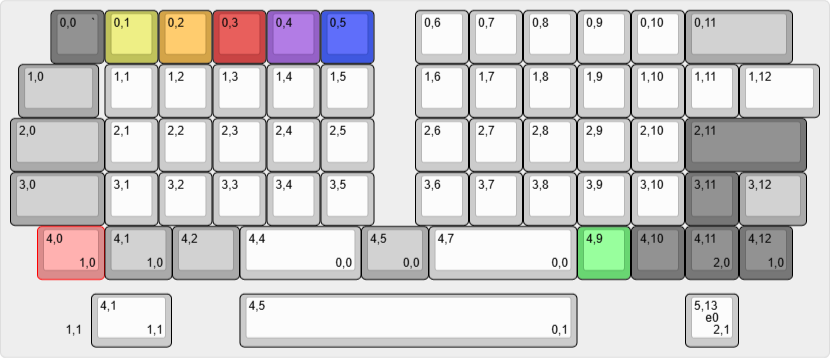

# OLSK60 キーボード操作ガイド（作成中...）

## 目次
1. [基本的な操作](#基本的な操作)
2. [レイヤー機能](#レイヤー機能)
3. [トラックポイントの操作](#トラックポイントの操作)
4. [トラックポイント加速設定](#トラックポイント加速設定)
5. [Remapでのカスタマイズ](#remapでのカスタマイズ)
6. [トラブルシューティング](#トラブルシューティング)
7. [注意事項](#注意事項)

## 基本的な操作

### キーボードの接続
1. USBケーブルをキーボードに接続します。
2. コンピューターのUSBポートに接続します。
3. キーボードが自動的に認識されます。

### 基本的なキー配列

- 標準的な60%キーボードレイアウトを採用しています。
- レイヤーキー（MO(1), MO(2)など）との組み合わせで、Fnキーや特殊キーも利用できます。
- トラックポイントを操作している間は自動的にマウスレイヤー（レイヤー3）へ遷移し、Spaceキーがマウス左ボタン、Deleteキーがマウス右ボタン、レイヤー1キーがスクロールモードボタンとして動作します。

## レイヤー機能

### レイヤー構成
- レイヤー0：通常のキー配列です。
- レイヤー1：Fnキーや特殊キーを配置しています。
- レイヤー2：キーボードの設定変更のためのキーを配置しています。
- レイヤー3：マウスボタン（左、右、スクロール）を配置しています。

### レイヤー切り替え方法
1. レイヤーキー（MO(1), MO(2)など）を押しながら対応するキーを押します。
2. レイヤーが切り替わると、LEDインジケーターの色が変化します。
   - 基本レイヤー：白
   - レイヤー1：水色
   - レイヤー2：緑色
   - レイヤー3：黄色～青色（マウス加速設定により色が変化します）

## トラックポイントの操作

- トラックポイントを操作している間は、自動的にレイヤー3（マウスレイヤー）に遷移します。
- レイヤー3には、マウスの左クリック・右クリック・スクロールなどのマウスボタンが割り当てられています。
- レイヤー3では、左下のCtrlキーが「レイヤーホールドキー」として機能します。
- マウス操作が終了しても、0.8秒間はレイヤー3が保持されます。その後、操作がなければ自動的に基本レイヤー（レイヤー0）に戻ります。
- レイヤー3に遷移した後、レイヤーホールドキー（左下Ctrlキー）を押し続けている間は、マウス操作をしていなくてもレイヤー3を保持し続けることができます。

## トラックポイント加速設定

OLSK60では、トラックポイントによるカーソル移動速度（加速）を5段階で設定できます。

- 特定のキーに割り当てたカスタムキーコードを入力することで、トラックポイントの加速水準を切り替えることができます。
- 初期レイアウトでは、レイヤー2の1～5のキーに「Accel_VL（Very Low）」「Accel_L（Low）」「Accel_M（Medium）」「Accel_H（High）」「Accel_VH（Very High）」の5水準が割り当てられています。
- 各加速水準の設定用キーを押すと、LEDが下記のように点灯します。
  - VL（Very Low）：黄色
  - L（Low）：オレンジ
  - M（Medium）：赤
  - H（High）：紫
  - VH（Very High）：青
- トラックポイント操作時に自動的にレイヤー3（マウスレイヤー）へ遷移し、その際に設定した加速水準に応じた色でLEDが点灯します。

## Remapでのカスタマイズ

### Remapの基本設定
1. [Remap](https://remap-keys.app/)にアクセスします。
2. 「キーボードをカスタマイズ」から進み、キーボードを選択します。
3. 画面の案内に従ってキーマップを編集します。

### カスタマイズ可能な項目
- キーマップの変更
- マクロの設定

## トラブルシューティング

### キーボードが認識されない場合
1. USBケーブルを抜き差ししてください。
2. 別のUSBポートを試してください。
3. 別のUSBケーブルを試してください。

### キーが反応しない場合
1. キーボードを再起動してください。
2. Remapでキーマップを確認してください。
3. ファームウェアを再インストールしてください。

### LEDが点灯しない場合
1. キーボードの電源を確認してください。
2. RemapでLED設定を確認してください。
3. ファームウェアを再インストールしてください。

## 注意事項
- キーボードの清掃は定期的に行ってください。
- 強い衝撃を与えないように注意してください。
- 水気のある場所での使用は避けてください。 