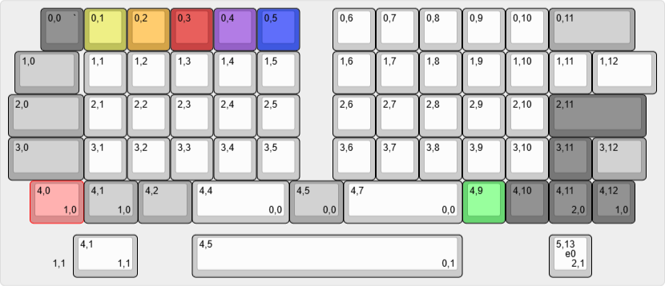

# OLSK60 キーボード操作ガイド

このドキュメントは、OLSK60 v2 の操作方法を総合的にまとめたものです。  
トラックポイントの詳細な速度設定については、[マウス機能操作マニュアル](OLSK60_mouse_manual.md)もあわせてご参照ください。

---

## クイックスタート

OLSK60 v2 を初めて使う方は、まずこのセクションをお読みください。

1. **接続:** USBケーブル（Type-C）でPCに接続します。LEDが白く点灯すれば正常です。
2. **基本入力:** レイヤー0（基本レイヤー）で通常のキー入力ができます。
3. **ファンクションキー:** 最下段の MO(1) キーを押しながら数字キーを押すと、F1〜F10 が入力できます。
4. **マウス操作:** トラックポイントを指先で軽く押してカーソルを移動。最下段のマウスボタンでクリックできます。
5. **スクロール:** トラックポイント操作中に自動でレイヤー3に切り替わり、MO(1)の位置のキーを押しながらトラックポイントを動かすとスクロールになります。
6. **設定変更:** MO(2) キーを押しながら操作すると、トラックポイント速度や音声などの設定を変更できます。

---

## 目次

1. [はじめに](#はじめに)
2. [レイヤー構成の全体像](#レイヤー構成の全体像)
3. [レイヤー0：基本レイヤー](#レイヤー0基本レイヤー)
4. [レイヤー1：Fnレイヤー](#レイヤー1fnレイヤー)
5. [レイヤー2：設定レイヤー](#レイヤー2設定レイヤー)
6. [レイヤー3：マウスレイヤー](#レイヤー3マウスレイヤー)
7. [トラックポイントの基本操作](#トラックポイントの基本操作)
8. [オートレイヤー機能](#オートレイヤー機能)
9. [音声フィードバック機能](#音声フィードバック機能)
10. [ロータリーエンコーダ](#ロータリーエンコーダ)
11. [LEDインジケーター](#ledインジケーター)
12. [Remapでのカスタマイズ](#remapでのカスタマイズ)
13. [特殊操作](#特殊操作)
14. [トラブルシューティング](#トラブルシューティング)

---

## はじめに

### キーボードの接続

1. USBケーブル（Type-C）をキーボードに接続します。
2. コンピューターのUSBポートに接続します。
3. キーボードが自動的に認識され、LEDが白く点灯すれば正常です。

### キーボードの基本構成

OLSK60 v2 は直交配列（格子配列）の60%キーボードです。

- 60キーの直交配列
- トラックポイントを中央に搭載
- 4つのレイヤーによるキーマップ切り替え
- ロータリーエンコーダ（オプション）
- LEDインジケーター（1個）

### ファームウェアの更新

ファームウェアの更新が必要な場合は、[firmware/README.md](../firmware/README.md) をご参照ください。

---

## レイヤー構成の全体像

OLSK60 は 4 つのレイヤーを持ち、それぞれ異なる役割を担っています。

| レイヤー | 名称 | 切り替え方法 | LED色 |
|----------|------|-------------|-------|
| レイヤー0 | 基本レイヤー | 常時有効（ベース） | 白 |
| レイヤー1 | Fnレイヤー | MO(1)キーを押している間 | 水色 |
| レイヤー2 | 設定レイヤー | MO(2)キーを押している間 | 緑 |
| レイヤー3 | マウスレイヤー | トラックポイント操作時に自動、またはMO(3)キー | プロファイル色 |

レイヤーは番号が大きいほど優先されます。レイヤー0は常にベースとして機能し、他のレイヤーがオフの場合に使用されます。

### レイヤーの切り替え方式

OLSK60 では**モーメンタリー方式（MO）**を採用しています。キーを押している間だけレイヤーが有効になり、離すと元のレイヤーに戻ります。

---

## レイヤー0：基本レイヤー

レイヤー0は通常の入力に使用する基本レイヤーです。標準的な60%キーボードに近い配置を直交配列で実現しています。

.png)

### 最上段

| 位置 | キー |
|------|------|
| 左端 | Esc |
| 数字列 | 1～0 |
| 右端 | Backspace（2U） |

### 2段目

| 位置 | キー |
|------|------|
| 左端 | Tab（1.5U） |
| 文字列 | Q W E R T ／ Y U I O P [ |
| 右端 | \（1.5U） |

### 3段目

| 位置 | キー |
|------|------|
| 左端 | Ctrl（1.75U） |
| 文字列 | A S D F G ／ H J K L ; |
| 右端 | Enter（2.25U） |

### 4段目

| 位置 | キー |
|------|------|
| 左端 | Shift（1.75U） |
| 文字列 | Z X C V B ／ N M , . / |
| 右端 | ↑, Shift（1.25U） |

### 最下段（デフォルトのスプリットスペースバーレイアウト）

左から順に：

| キー | サイズ | 説明 |
|------|--------|------|
| Ctrl | 1.25U | 左Ctrl |
| Win | 1.25U | 左Win/Cmd |
| Alt | 1.5U | 左Alt |
| マウス左ボタン | 1U | 常にマウス左クリックとして動作 |
| マウス右ボタン | 1U | 常にマウス右クリックとして動作 |
| MO(1) | 1.25U | 押している間レイヤー1に切り替え |
| Space | 1U | スペースキー |
| Delete | 1.75U | Deleteキー |
| MO(2) | 1U | 押している間レイヤー2に切り替え |
| ← | 1U | カーソルキー左 |
| ↓ | 1U | カーソルキー下 |
| → | 1U | カーソルキー右 |

**マウス左ボタン・マウス右ボタンは、レイヤーに関係なく常にマウスボタンとして動作します。** トラックポイントでカーソルを動かしながら、親指で左右クリックを行えます。

### スペースバーのレイアウトオプション

OLSK60 は Remap を使用して、最下段のスペースバー部分を3種類のレイアウトから選択できます。

| オプション | 構成 |
|-----------|------|
| スプリットスペース（デフォルト） | 上記テーブルの通り、独立した複数キーで構成 |
| 3分割スペース | 2.25Uと2.75Uのスペースを含む4キー構成 |
| 6.25Uスペース | 標準的な長いスペースバー |

---

## レイヤー1：Fnレイヤー

MO(1)キーを押している間、有効になります。ファンクションキーやカーソル移動関連のキーが配置されています。レイヤー0とレイヤー1を合わせて、概ねテンキーレスキーボード相当のキーをカバーしています。

.png)

### 主な変更点

| キー位置 | レイヤー0 | レイヤー1 |
|----------|----------|----------|
| 最上段左端 | Esc | ` (グレイヴ) |
| 数字列 | 1～0 | F1～F10 |
| Q / W | Q / W | F11 / F12 |
| E / S / D / F | 文字 | ↑ / ← / ↓ / →（カーソル） |
| I | I | Insert |
| P | P | Print Screen |
| CapsLock位置 | Ctrl | Caps Lock |
| J / K / L | 文字 | - / = / [ |
| ; | ; | ] |
| 右端（2段目） | \ | ¥ |
| ↑ / ↓ | ↑ / ↓ | Page Up / Page Down |
| ← / → | ← / → | Home / End |

---

## レイヤー2：設定レイヤー

MO(2)キーを押している間、有効になります。トラックポイントの速度設定、音声機能の設定、オートレイヤーの設定を行うレイヤーです。

.png)

以下のキーマトリクス図は、設定レイヤーでの各キーの物理配置を示しています。色付きのキーがトラックポイント速度プロファイルの選択キーです。

### トラックポイント速度プロファイル選択（数字列）

| キー | 機能 | 説明 |
|------|------|------|
| 1 | Precision | 低速・精密操作（固定プロファイル） |
| 2 | Balanced | 標準速度（固定プロファイル） |
| 3 | Fast | 高速（固定プロファイル）**※デフォルト** |
| 4 | Custom Precision | ユーザー編集可能な低速カスタム |
| 5 | Custom Fast | ユーザー編集可能な高速カスタム |

プロファイルの詳細は[マウス機能操作マニュアル](OLSK60_mouse_manual.md)をご参照ください。

### カスタムバンクのパラメータ調整（2～3段目左側）

以下のキーは**Custom Precision（4）または Custom Fast（5）を選択中のみ有効**です。固定プロファイル選択中に押すとLEDが赤く3回点滅し、操作が拒否されます。

| キー | 機能 |
|------|------|
| Q | 基本速度を上げる |
| W | 基本速度を下げる |
| A | 加速度を上げる |
| S | 加速度を下げる |
| D | 減速度を上げる |
| F | 減速度を下げる |

### オートレイヤー遅延設定（2段目右側）

| キー | 機能 | 説明 |
|------|------|------|
| Y | 短い（150ms） | トラックポイントから手を離した後、素早くレイヤー3を解除 |
| U | 中間（400ms） | 速さと操作猶予のバランス |
| I | 長い（800ms） | 従来どおりゆっくり保持 **※デフォルト** |
| O | オートレイヤー ON/OFF | オートレイヤー機能自体の有効/無効切り替え |

### 音声設定（4段目左側）

| キー | 機能 |
|------|------|
| Z | 全音声 ON/OFF |
| X | サウンドモード切替（ランダム ↔ ピアノ） |

### 特殊操作（最上段両端）

| キー | 機能 | 説明 |
|------|------|------|
| Esc位置 | EEPROM消去 | 全設定を工場出荷状態にリセット |
| Backspace位置 | 再起動 | キーボードを再起動 |

> ⚠️ **注意:** EEPROM消去を実行すると、トラックポイントのカスタムバンク設定、音声設定、オートレイヤー設定がすべて初期値に戻ります。Remapで設定したキーマップも初期化されます。

---

## レイヤー3：マウスレイヤー

トラックポイントの操作時に自動的に有効になるレイヤーです（オートレイヤー機能）。

.png)

### レイヤー0からの主な変更点

レイヤー3では、ほとんどのキーはレイヤー0と同じですが、最下段の一部が変わります。

| キー位置 | レイヤー0 | レイヤー3 |
|----------|----------|----------|
| MO(1)の位置 | レイヤー1切替 | スクロールモード |
| MO(2)の位置 | レイヤー2切替 | レイヤー1切替 |

**スクロールモード**: このキーを押している間、トラックポイントの移動がスクロール操作に変換されます。上下にスクロールするほか、左右のスクロールも可能です。

---

## トラックポイントの基本操作

### カーソル移動

トラックポイントを指先で軽く押すことでカーソルを移動できます。押す力の強さに応じてカーソルの移動速度が変化します。

### マウスボタン

最下段に配置された専用キーで操作します。

| 操作 | キー | 備考 |
|------|------|------|
| 左クリック | マウス左ボタン | レイヤーに関係なく常時有効 |
| 右クリック | マウス右ボタン | レイヤーに関係なく常時有効 |
| スクロール | スクロールモードキー | レイヤー3でMO(1)の位置。ホールド中にトラックポイントを動かすとスクロール |

### スクロール操作

レイヤー3がアクティブな状態で、スクロールモードキーを押しながらトラックポイントを動かすと、カーソル移動ではなくスクロール操作になります。

- 上下方向：ページの縦スクロール
- 左右方向：ページの横スクロール

### Depress機能（トラックポイント押し下げクリック）

トラックポイントを軽く押し下げることでクリック操作が可能です。この機能は起動時に自動的に有効化されます。

---

## オートレイヤー機能

トラックポイントを操作すると、自動的にレイヤー3（マウスレイヤー）に切り替わります。これにより、スクロールモードキーが使えるようになります。

### 動作の流れ

1. トラックポイントを動かすと、レイヤー3が自動的に有効になります。
2. トラックポイントの操作を停止すると、設定した時間の経過後にレイヤー3が自動的に解除されます。
3. マウスボタン、モディファイヤーキー（Shift, Ctrl等）、スクロールモードキーを押している間は、レイヤー3が維持されます。

### 解除タイミングの調整

レイヤー2で、オートレイヤーが解除されるまでの時間を3段階から選択できます。

| 設定 | 遅延時間 | LED色 | 用途 |
|------|---------|-------|------|
| 短い | 150ms | 赤 | キー入力を優先したい場合 |
| 中間 | 400ms | 緑 | バランスの取れた設定 |
| 長い（デフォルト） | 800ms | 青 | マウス操作を優先したい場合 |

### オートレイヤーの無効化

レイヤー2 + O キーで、オートレイヤー機能自体の ON/OFF を切り替えられます。

- **ON** → 緑が2回点滅
- **OFF** → 赤が2回点滅

OFF にしても、トラックポイントのカーソル移動やマウスボタンは通常どおり動作します。スクロールモードを使用したい場合は、MO(3)キーをキーマップに割り当てて手動でレイヤー3を有効にしてください。

---

## 音声フィードバック機能

OLSK60 はキー入力時に電子音を鳴らす音声フィードバック機能を搭載しています。デフォルトではOFFになっています。

### 全音声の ON/OFF

レイヤー2 + Z キーで音声機能をまとめて ON/OFF できます。

- **ON** → 緑が2回点滅
- **OFF** → 赤が2回点滅

### サウンドモード

レイヤー2 + X キーで2つのモードを切り替えられます（音声がONの場合のみ有効。OFFの場合はLEDが赤く3回点滅し、操作が拒否されます）。

| モード | LED色 | 説明 |
|--------|-------|------|
| ランダムモード | 黄 | キーを押すたびにランダムな電子音が鳴ります |
| ピアノモード | 青 | キーの位置に応じた音階で発音します |

### ピアノモード

ピアノモードでは、キーボードの中段を中心にピアノの鍵盤のように音階が割り当てられます。

**白鍵に相当するキー（左から）：**
A → C（ド）、S → D（レ）、D → E（ミ）、F → F（ファ）、G → G（ソ）、H → A（ラ）、J → B（シ）、K → C（ド・1オクターブ上）、L → D（レ・1オクターブ上）、; → E（ミ・1オクターブ上）

**黒鍵に相当するキー：**
W → C#、E → D#、T → F#、Y → G#、U → A#、O → C#（1オクターブ上）、P → D#（1オクターブ上）

### ピアノオクターブの調整

ロータリーエンコーダ搭載モデルでは、レイヤー2でエンコーダを回すとピアノの音域を上下にシフトできます（-3～+3オクターブ）。

### Enterキーのタイプライター音

音声がONの状態でEnterキーを押すと、タイプライター風の効果音が鳴ります。

---

## ロータリーエンコーダ

ロータリーエンコーダ搭載モデルでは、各レイヤーでエンコーダに異なる機能が割り当てられています。

| レイヤー | 時計回り | 反時計回り |
|----------|---------|----------|
| レイヤー0 | 音量ダウン | 音量アップ |
| レイヤー1 | Page Down | Page Up |
| レイヤー2 | ピアノオクターブ上げ | ピアノオクターブ下げ |
| レイヤー3 | （無効） | （無効） |

> **補足:** レイヤー0の回転方向と音量の対応は、エンコーダの取り付け向きに依存します。直感と異なる場合は、Remapでキーを入れ替えて調整できます。

---

## LEDインジケーター

OLSK60 には1個のLEDインジケーターがあり、現在のレイヤーやトラックポイントの設定状態を色で表示します。

### レイヤー表示

| 状態 | LED色 |
|------|-------|
| レイヤー0（通常時） | 白（暗め） |
| レイヤー1（Fn使用時） | 水色 |
| レイヤー2（設定変更時） | 緑 |
| レイヤー3（マウス操作時） | 速度プロファイルに応じた色 |

### トラックポイント速度プロファイルの色

レイヤー3がアクティブな時、選択中の速度プロファイルに応じた色で表示されます。

| プロファイル | LED色 |
|-------------|-------|
| Precision（精密） | 青 |
| Balanced（標準） | 緑 |
| Fast（高速） | 赤 |
| Custom Precision（カスタム精密） | 紫 |
| Custom Fast（カスタム高速） | オレンジ |

### 設定操作時のLEDフィードバック

| 操作 | LED表示 |
|------|--------|
| プロファイル変更 | 対応色が2回点滅 |
| カスタムパラメータ調整成功（増加） | 明るい緑が1回点滅 |
| カスタムパラメータ調整成功（減少） | 暗い緑が1回点滅 |
| 操作拒否（固定プロファイル中の調整等） | 赤が3回点滅 |
| 音声ON | 緑が2回点滅 |
| 音声OFF | 赤が2回点滅 |
| サウンドモード：ピアノ | 青が2回点滅 |
| サウンドモード：ランダム | 黄が2回点滅 |
| オートレイヤー遅延変更 | 設定に対応した色が1回点滅 |
| オートレイヤーON | 緑が2回点滅 |
| オートレイヤーOFF | 赤が2回点滅 |

---

## Remapでのカスタマイズ

### Remapとは

[Remap](https://remap-keys.app/)は、VIA互換のWebブラウザ上で動作するキーマップ編集ツールです。OLSK60 は Remap に対応しており、ソフトウェアのインストールなしにキーマップをカスタマイズできます。

### 基本的な使い方

1. Webブラウザで [https://remap-keys.app/](https://remap-keys.app/) にアクセスします。
2. 「START REMAP FOR YOUR KEYBOARD」をクリックします。
3. キーボードの接続を求められるので、OLSK60 を選択します。
4. キーマップが表示されたら、変更したいキーをクリックして新しいキーを割り当てます。
5. 「flash」ボタンを押すと、変更がキーボードに書き込まれます。

### カスタマイズ可能な項目

- 各レイヤーのキーマップ変更
- スペースバーのレイアウトオプション切り替え
- カスタムキーコード（トラックポイント速度設定、音声設定等）の配置変更
- マクロの設定

### マトリクステスター

Remapにはマトリクステスター機能があり、すべてのキーが正しく動作するかを確認できます。キースイッチ取り付け後の動作確認にご活用ください。

---

## 特殊操作

### EEPROM消去（設定の全リセット）

レイヤー2の左上端キー（Esc位置）を押すと、EEPROMが消去されます。すべての設定が工場出荷状態に戻ります。

**リセットされる項目：**
- トラックポイントのカスタムバンク設定
- 速度プロファイルの選択状態
- 音声機能の設定
- オートレイヤー遅延の設定
- Remapで変更したキーマップ

### キーボードの再起動

レイヤー2の右上端キー（Backspace位置）を押すと、キーボードが再起動します。設定は保持されます。

### ブートローダーモード（ファームウェア書き込み用）

ESCキーを押しながらUSBケーブルを接続すると、ブートローダーモードで起動します。ファームウェアの更新時に使用します。詳しくは [firmware/README.md](../firmware/README.md) をご参照ください。

---

## トラブルシューティング

| 症状 | 対処方法 |
|------|----------|
| キーボードが認識されない | 1. USBケーブルを抜き差し → 2. 別のUSBポートを試す → 3. 別のケーブルを試す |
| 特定のキーが反応しない | 1. Remapのマトリクステスターで確認 → 2. キースイッチを挿し直す → 3. スイッチのピンが曲がっていないか確認 |
| トラックポイントが動かない | 1. ケーブルを抜き差しして再起動 → 2. フラットケーブルの接続を確認（[ビルドガイド](buildguide.md)参照） |
| LEDが点灯しない | 1. USBケーブルを抜き差し → 2. ファームウェアの再書き込みを試す |
| カスタム設定がリセットされてしまう | EEPROM消去キー（レイヤー2 + 左上端）を誤って押していないか確認。意図しないリセットの場合はファームウェアの再書き込みをお試しください |
| トラックポイントの速度が合わない | レイヤー2で速度プロファイルを変更。詳細は[マウス機能操作マニュアル](OLSK60_mouse_manual.md)参照 |
| 音が鳴らない | レイヤー2 + Z で音声機能がONか確認（緑2回点滅 = ON） |
| スクロールが効かない | レイヤー3が有効になっているか確認（LEDがプロファイル色）。スクロールモードキーを押しながらトラックポイントを操作 |
| キーマップがおかしい | Remapに接続してキーマップを確認。必要に応じてレイヤー2 + 左上端でEEPROM消去（全設定リセット） |

---

## 注意事項

- キーボードの清掃は定期的に行ってください。
- 強い衝撃を与えないように注意してください。
- 水気のある場所での使用は避けてください。
- トラックポイントの操作は軽い力で行ってください。無理な力を加えると破損の原因になります。

---

## サポート

ご不明点があれば [BOOTHの商品ページ](https://techmech.booth.pm/items/5896343)、[遊舎工房の商品ページ](https://shop.yushakobo.jp/products/11324)、または [GitHub Issue](https://github.com/techmech-keeb/OLSK60_v2/issues) にてご連絡ください。
