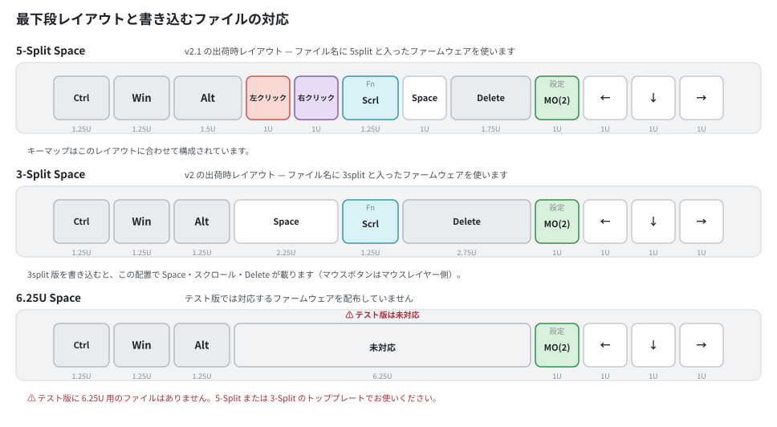
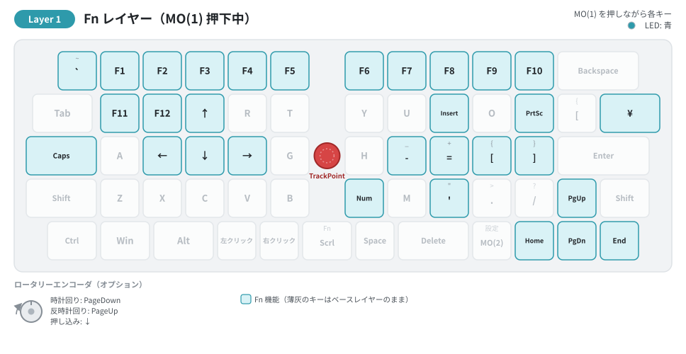
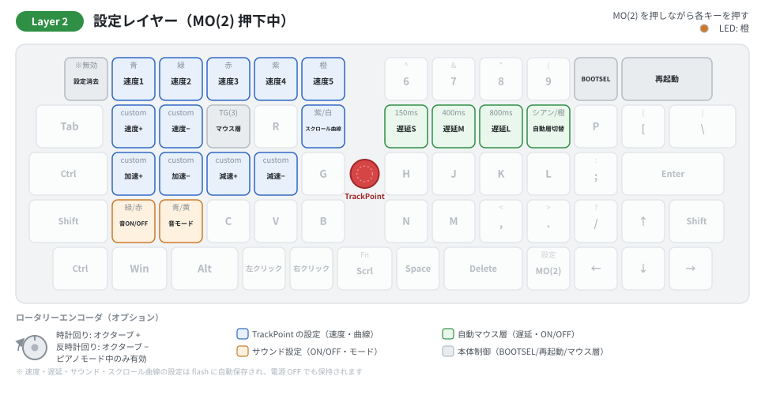
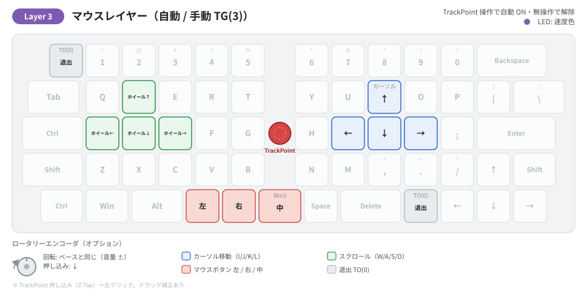
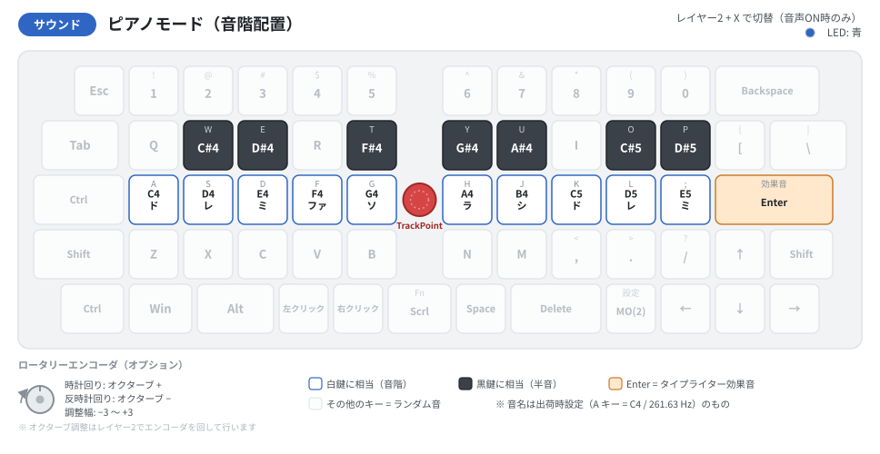

# OLSK60 キーボード操作ガイド

このドキュメントは、OLSK60 v2 シリーズ（v2 / v2.1）の操作方法を総合的にまとめたものです。  
トラックポイントの詳細な速度設定については、[マウス機能操作マニュアル](OLSK60_mouse_manual.md)もあわせてご参照ください。

> **本書が前提とするファームウェア:** 本書は**テスト版（リリース候補）ファームウェア**の出荷時キーマップを説明しています。正式配布版をお使いの方は、[最新の正式リリース](https://github.com/techmech-keeb/OLSK60_v2/releases/latest)に対応した通常版のドキュメントをご覧ください。テスト版の入手と書き込みは [firmware/README.md](../firmware/README.md) をご参照ください。
>
> テスト版の主な違い: **設定ツールは Vial のみ**（Remap / VIA 非対応）、**スペース列ごとに出荷時キーマップ（プリセット）を用意**、**同時に押せるキーは 6 キーまで**。

---

## クイックスタート

OLSK60 v2 を初めて使う方は、まずこのセクションをお読みください。

1. **接続:** USBケーブル（Type-C）でPCに接続します。LEDが白く点灯すれば正常です。
2. **基本入力:** レイヤー0（基本レイヤー）で通常のキー入力ができます。
3. **ファンクションキー:** 最下段の **Scrl キー**（左親指・Fn 兼用）を押しながら数字キーを押すと、F1〜F10 が入力できます。
4. **マウス操作:** トラックポイントを指先で軽く押してカーソルを移動。最下段のマウスボタンでクリックできます。
5. **スクロール:** 最下段の **Scrl キー**（左親指・Fn と兼用）を押しながらトラックポイントを動かすとスクロールになります。
6. **設定変更:** MO(2) キーを押しながら操作すると、トラックポイント速度や音声などの設定を変更できます。

---

## 目次

1. [はじめに](#はじめに)
2. [レイヤー構成の全体像](#レイヤー構成の全体像)
3. [レイヤー0：基本レイヤー](#レイヤー0基本レイヤー)
4. [レイヤー1：Fnレイヤー](#レイヤー1fnレイヤー)
5. [レイヤー2：設定レイヤー](#レイヤー2設定レイヤー)
6. [レイヤー3：マウスレイヤー](#レイヤー3マウスレイヤー)
7. [トラックポイントの基本操作](#トラックポイントの基本操作)
8. [オートレイヤー機能](#オートレイヤー機能)
9. [音声フィードバック機能](#音声フィードバック機能)
10. [ロータリーエンコーダ](#ロータリーエンコーダ)
11. [LEDインジケーター](#ledインジケーター)
12. [キーマップのカスタマイズ](#キーマップのカスタマイズ)
13. [特殊操作](#特殊操作)
14. [トラブルシューティング](#トラブルシューティング)

---

## はじめに

### キーボードの接続

1. USBケーブル（Type-C）をキーボードに接続します。
2. コンピューターのUSBポートに接続します。
3. キーボードが自動的に認識され、LEDが白く点灯すれば正常です。

### キーボードの基本構成

OLSK60 v2 は直交配列（格子配列）の60%キーボードです。

- 60キーの直交配列
- トラックポイントを中央に搭載
- 4つのレイヤーによるキーマップ切り替え
- ロータリーエンコーダ（オプション）
- LEDインジケーター（1個）

### ファームウェアと設定ツール

テスト版のキーマップ編集には **Vial** を使います（詳しくは[キーマップのカスタマイズ](#キーマップのカスタマイズ)を参照）。ファームウェアの選び方・書き込み手順は [firmware/README.md](../firmware/README.md) をご参照ください。

---

## レイヤー構成の全体像

OLSK60 は 4 つのレイヤーを持ち、それぞれ異なる役割を担っています。

| レイヤー | 名称 | 切り替え方法 | LED色 |
|----------|------|-------------|-------|
| レイヤー0 | 基本レイヤー | 常時有効（ベース） | 白（暗め） |
| レイヤー1 | Fnレイヤー | Scrl キー（左親指）を押している間 | 青 |
| レイヤー2 | 設定レイヤー | MO(2)キーを押している間 | 橙 |
| レイヤー3 | マウスレイヤー | トラックポイント操作時に自動、またはレイヤー2の E キー（TG(3)）で手動 | 自動時は速度プロファイル色、手動時は白（暗め） |

レイヤーは番号が大きいほど優先されます。レイヤー0は常にベースとして機能し、他のレイヤーがオフの場合に使用されます。

### レイヤーの切り替え方式

OLSK60 では**モーメンタリー方式（MO）**を採用しています。キーを押している間だけレイヤーが有効になり、離すと元のレイヤーに戻ります。レイヤー3だけは例外で、トラックポイント操作で自動的に有効になり、操作をやめると設定時間後に解除されます（レイヤー2の E キーで手動 ON/OFF も可能）。

---

## レイヤー0：基本レイヤー

レイヤー0は通常の入力に使用する基本レイヤーです。標準的な60%キーボードに近い配置を直交配列で実現しています。

### 最上段

| 位置 | キー |
|------|------|
| 左端 | Esc |
| 数字列 | 1～0 |
| 右端 | Backspace（2U） |

### 2段目

| 位置 | キー |
|------|------|
| 左端 | Tab（1.5U） |
| 文字列 | Q W E R T ／ Y U I O P [ |
| 右端 | \（1.5U） |

### 3段目

| 位置 | キー |
|------|------|
| 左端 | Ctrl（1.75U） |
| 文字列 | A S D F G ／ H J K L ; |
| 右端 | Enter（2.25U） |

### 4段目

| 位置 | キー |
|------|------|
| 左端 | Shift（1.75U） |
| 文字列 | Z X C V B ／ N M , . / |
| 右端 | ↑, Shift（1.25U） |

### 最下段（5-Split-Spaceレイアウトの場合）

> **注意:** 以下の最下段配列は、v2.1の出荷時（デフォルト）レイアウトである 5-Split-Space 版ファームウェアの場合です。3-Split-Space 版は並びが異なります（[スペースバーのレイアウトオプション](#スペースバーのレイアウトオプション)参照）。

左から順に：

| キー | サイズ | 説明 |
|------|--------|------|
| Ctrl | 1.25U | 左Ctrl |
| Win | 1.25U | 左Win/Cmd |
| Alt | 1.5U | 左Alt |
| マウス左ボタン | 1U | 常にマウス左クリックとして動作 |
| マウス右ボタン | 1U | 常にマウス右クリックとして動作 |
| Scrl（Fn） | 1.25U | 押している間 **トラックポイントがスクロールになり、同時にレイヤー1（Fn）も有効**になります |
| Space | 1U | スペースキー |
| Delete | 1.75U | Deleteキー |
| MO(2) | 1U | 押している間レイヤー2に切り替え |
| ← | 1U | カーソルキー左 |
| ↓ | 1U | カーソルキー下 |
| → | 1U | カーソルキー右 |

**マウス左ボタン・マウス右ボタンは、レイヤーに関係なく常にマウスボタンとして動作します。** トラックポイントでカーソルを動かしながら、親指で左右クリックを行えます。

> **Scrl キーについて:** 従来の Fn キー（MO(1)）の位置が、テスト版では **Scrl キー**になりました。押している間は Fn レイヤーが有効になるので **Fn の機能はそのまま使えます**。加えて、押しながらトラックポイントを動かすとスクロールになります。

### スペースバーのレイアウトオプション

**テスト版のファームウェアは、機能はどれも同じです。**配布ファイルが 2 つあるのは、**出荷時のキーマップ（プリセット）**が 2 通りあるためで、スペース列ごとに「そのまま使える」配置を用意しています。**どちらを書き込んでも動作し**、キー配置は Vial でいつでも変更できます。

| オプション | 構成 | 対応モデル | そのまま使えるプリセット |
|-----------|------|-----------|--------------------|
| 5-Split-Space | 1U、1U、1.25U、1U、1.75Uの5キー構成 | **v2.1のみ**（v2.1のデフォルト） | `..._Vial_5split.uf2` |
| 3-Split-Space | 2.25U、1.25U、2.75Uの3キー構成 | v2 / v2.1（v2のデフォルト） | `..._Vial_3split.uf2` |
| 6.25U Space | 標準的な6.25Uスペースバー | v2 / v2.1 | 専用プリセットはありません（いずれかを書き込み、Vial で割り当ててください） |

> **注意:** 5-Split-Spaceレイアウトはv2.1でのみ選択可能です。v2.1は出荷時に5-Split-Spaceで構成されています。v2の基板はこのレイアウトに対応していません。お手持ちのモデルがv2かv2.1か不明な場合は、基板上のシルク印刷をご確認ください。

以下の図は、各レイアウトオプションに出荷時キーマップのキーがどう対応するかを示しています。

> **プリセットが合っていないとどうなるか:** 例えば 3-Split のキーボードに 5-Split 用のプリセットを書き込むと、Space が**物理キーの無い位置**に載るため、そのままでは Space が打てません。壊れているわけではなく、**Vial で Space を押せる位置に割り当て直せばそのまま使えます**。手間を省きたい場合は、最初からお使いのスペース列に合うプリセットを選んでください。

> **3-Split 版のキー配置:** 最下段は左から Ctrl / Win / Alt / **Space（2.25U）** / **Scrl（1.25U）** / **Delete（2.75U）** / MO(2) / ←↓→ です。**マウス左右ボタンは最下段ではなくマウスレイヤー側**（トラックポイント操作中）に載ります。

> **設定ツールのレイアウト表示について:** Vial のレイアウトオプションは**画面に表示するキーの形**を切り替えるだけで、打鍵の割り当ては変わりません。3-Split 版を書き込んだ直後は表示が 5-Split になっていることがあるので、Vial の Layout タブで 3-Split を選び直してください（表示だけの設定です）。

> 💡 各レイアウトで**どのサイズのキーキャップが何個必要か**は、ビルドガイドの[キーキャップサイズガイド](buildguide.md#31-キーキャップサイズガイド)にレイアウト別の図と数量表を用意しています。

---

## レイヤー1：Fnレイヤー

最下段の **Scrl キー**（左親指）を押している間、有効になります。ファンクションキーやカーソル移動関連のキーが配置されています。レイヤー0とレイヤー1を合わせて、概ねテンキーレスキーボード相当のキーをカバーしています。

> 図中の薄いグレーのキーはレイヤー0と同じ動作です（以降のレイヤー図も同様）。

### 主な変更点

| キー位置 | レイヤー0 | レイヤー1 |
|----------|----------|----------|
| 最上段左端 | Esc | ` (グレイヴ) |
| 数字列 | 1～0 | F1～F10 |
| Q / W | Q / W | F11 / F12 |
| E / S / D / F | 文字 | ↑ / ← / ↓ / →（カーソル） |
| I | I | Insert |
| P | P | Print Screen |
| CapsLock位置 | Ctrl | Caps Lock |
| J / K / L | 文字 | - / = / [ |
| ; | ; | ] |
| 右端（2段目） | \ | ¥ |
| ↑ / ↓ | ↑ / ↓ | Page Up / Page Down |
| ← / → | ← / → | Home / End |

---

## レイヤー2：設定レイヤー

MO(2)キーを押している間、有効になります。トラックポイントの速度設定、音声機能の設定、オートレイヤーの設定を行うレイヤーです。

### トラックポイント速度プロファイル選択（数字列）

| キー | 機能 | 説明 |
|------|------|------|
| 1 | 速度1（Precision） | 低速・精密操作（固定プロファイル）／LED 青 |
| 2 | 速度2（Balanced） | 標準速度（固定プロファイル）／LED 緑 |
| 3 | 速度3（Fast） | 高速（固定プロファイル）／LED 赤 **※デフォルト** |
| 4 | 速度4（カスタム） | ユーザー編集可能な低速カスタム／LED 紫 |
| 5 | 速度5（カスタム） | ユーザー編集可能な高速カスタム／LED 橙 |

プロファイルの詳細は[マウス機能操作マニュアル](OLSK60_mouse_manual.md)をご参照ください。

### カスタムバンクのパラメータ調整（2～3段目左側）

以下のキーは**カスタム（4 または 5）を選択中のみ有効**です。固定プロファイル（1〜3）選択中や調整範囲の端で押すと、LED が赤く3回点滅し、操作が拒否されます。

| キー | 機能 |
|------|------|
| Q | 基本速度を上げる |
| W | 基本速度を下げる |
| A | 加速度を上げる |
| S | 加速度を下げる |
| D | 減速度を上げる |
| F | 減速度を下げる |

### オートレイヤー遅延設定（2段目右側）

| キー | 機能 | 説明 |
|------|------|------|
| Y | 短い（150ms） | トラックポイントから手を離した後、素早くレイヤー3を解除 |
| U | 中間（400ms） | 速さと操作猶予のバランス |
| I | 長い（800ms） | 従来どおりゆっくり保持 **※デフォルト** |
| O | オートレイヤー ON/OFF | オートレイヤー機能自体の有効/無効切り替え（ON = シアン、OFF = 橙が2回点滅） |

### スクロールの効き方（T キー）

| キー | 機能 | 説明 |
|------|------|------|
| T | スクロールの効き方の切り替え | **ON（マゼンタが2回点滅）**: 弱く押すと細かく、強く押すほど速く進みます（出荷時）。**OFF（白が2回点滅）**: 押し込みの強さに比例した従来の動きに戻ります。 |

> ホストによってはスクロールの加速が二重にかかることがあります。速すぎると感じたら OFF をお試しください。

### 音声設定（4段目左側）

| キー | 機能 |
|------|------|
| Z | 全音声 ON/OFF |
| X | サウンドモード切替（ランダム ↔ ピアノ） |

### 特殊操作（最上段両端）

| キー | 機能 | 説明 |
|------|------|------|
| Esc位置 | 設定の全消去 | 保存された設定を工場出荷状態にリセット |
| P位置（右から2番目） | 書き込みモード（BOOTSEL） | ファームウェア書き込み用のモードで再起動します |
| Backspace位置 | 再起動 | キーボードを再起動 |

> ⚠️ **注意:** 設定の全消去を実行すると、トラックポイントのカスタムバンク設定、音声設定、オートレイヤー設定、スクロールの効き方がすべて初期値に戻ります。設定ツールで変更したキーマップも初期化されます。

---

## レイヤー3：マウスレイヤー

トラックポイントの操作時に自動的に有効になるレイヤーです（オートレイヤー機能）。

### レイヤー0からの主な変更点

レイヤー3では、ほとんどのキーはレイヤー0と同じですが、最下段の一部が変わります。

| キー位置 | レイヤー0 | レイヤー3 |
|----------|----------|----------|
| Esc の位置 | Esc | レイヤー3を抜ける（TO(0)） |
| W / A / S / D | 文字 | ホイール ↑ / ← / ↓ / → |
| I / J / K / L | 文字 | カーソル ↑ / ← / ↓ / → |
| マウス左・右ボタンの位置 | マウス左・右ボタン | 同じ（左・右クリック） |
| Scrl の位置 | スクロール＋Fn | マウス中ボタン（5-Split の場合） |
| MO(2)の位置 | レイヤー2切替 | レイヤー3を抜ける（TO(0)） |

> **3-Split 版**では最下段の並びが変わり、レイヤー3では左から **マウス左ボタン / スクロール / マウス右ボタン**になります。

**スクロールしたいとき**は、最下段の **Scrl キー**を押しながらトラックポイントを動かします（レイヤー3が有効かどうかに関わらず使えます）。上下だけでなく左右のスクロールもできます。

---

## トラックポイントの基本操作

### カーソル移動

トラックポイントを指先で軽く押すことでカーソルを移動できます。押す力の強さに応じてカーソルの移動速度が変化します。

### マウスボタン

最下段に配置された専用キーで操作します。

| 操作 | キー | 備考 |
|------|------|------|
| 左クリック | マウス左ボタン | レイヤーに関係なく常時有効（3-Split 版はマウスレイヤー側） |
| 右クリック | マウス右ボタン | レイヤーに関係なく常時有効（3-Split 版はマウスレイヤー側） |
| スクロール | Scrl キー（最下段・左親指） | 押している間、トラックポイントの動きがスクロールになります |

### スクロール操作

最下段の **Scrl キー**を押しながらトラックポイントを動かすと、カーソル移動ではなくスクロール操作になります。押している間は Fn レイヤーも有効です。

- 上下方向：ページの縦スクロール
- 左右方向：ページの横スクロール

**テスト版ではスクロールが滑らかになりました。**1 ノッチより細かい単位で送るため、ゆっくり動かしたときの追従が改善します。また、**弱く押すと細かく、強く押すほど速く進む**調整が出荷時から有効です。従来の動きに戻したい場合は、レイヤー2の **T キー**で切り替えてください。

### Depress機能（トラックポイント押し下げクリック）

トラックポイントを軽く押し下げることでクリック操作が可能です。この機能は起動時に自動的に有効化されます。

---

## オートレイヤー機能

トラックポイントを操作すると、自動的にレイヤー3（マウスレイヤー）に切り替わります。最下段のキーがマウスボタン用に変わり、W/A/S/D・I/J/K/L でホイールとカーソルも操作できます。

### 動作の流れ

1. トラックポイントを動かすと、レイヤー3が自動的に有効になります。
2. トラックポイントの操作を停止すると、設定した時間の経過後にレイヤー3が自動的に解除されます。
3. マウスボタンや Scrl キーを押している間は、レイヤー3が維持されます。
4. レイヤー1・レイヤー2を表示している間は、自動では切り替わりません。

### 解除タイミングの調整

レイヤー2で、オートレイヤーが解除されるまでの時間を3段階から選択できます。

| 設定 | 遅延時間 | LED色 | 用途 |
|------|---------|-------|------|
| 短い | 150ms | 赤 | キー入力を優先したい場合 |
| 中間 | 400ms | 緑 | バランスの取れた設定 |
| 長い（デフォルト） | 800ms | 青 | マウス操作を優先したい場合 |

### オートレイヤーの無効化

レイヤー2 + O キーで、オートレイヤー機能自体の ON/OFF を切り替えられます。

- **ON** → シアンが2回点滅
- **OFF** → 橙が2回点滅

OFF にしても、トラックポイントのカーソル移動・マウスボタン・**Scrl キーでのスクロール**は通常どおり使えます（スクロールはレイヤー3に依存しません）。マウスレイヤーを手動で使いたい場合は、レイヤー2の **E キー（TG(3)）**で ON/OFF できます。

---

## 音声フィードバック機能

OLSK60 はキー入力時に電子音を鳴らす音声フィードバック機能を搭載しています。デフォルトではOFFになっています。

### 全音声の ON/OFF

レイヤー2 + Z キーで音声機能をまとめて ON/OFF できます。

- **ON** → 緑が2回点滅
- **OFF** → 赤が2回点滅

### サウンドモード

レイヤー2 + X キーで2つのモードを切り替えられます（音声がONの場合のみ有効。OFFの場合はLEDが赤く3回点滅し、操作が拒否されます）。

| モード | LED色 | 説明 |
|--------|-------|------|
| ランダムモード | 黄緑 | キーを押すたびにランダムな電子音が鳴ります |
| ピアノモード | 青 | キーの位置に応じた音階で発音します |

### ピアノモード

ピアノモードでは、キーボードの中段を中心にピアノの鍵盤のように音階が割り当てられます。

**白鍵に相当するキー（左から）：**
A → C（ド）、S → D（レ）、D → E（ミ）、F → F（ファ）、G → G（ソ）、H → A（ラ）、J → B（シ）、K → C（ド・1オクターブ上）、L → D（レ・1オクターブ上）、; → E（ミ・1オクターブ上）

**黒鍵に相当するキー：**
W → C#、E → D#、T → F#、Y → G#、U → A#、O → C#（1オクターブ上）、P → D#（1オクターブ上）

### ピアノオクターブの調整

ロータリーエンコーダ搭載モデルでは、レイヤー2でエンコーダを回すとピアノの音域を上下にシフトできます（-3～+3オクターブ）。

### Enterキーのタイプライター音

音声がONの状態でEnterキーを押すと、タイプライター風の効果音が鳴ります。

---

## ロータリーエンコーダ

ロータリーエンコーダ搭載モデルでは、各レイヤーでエンコーダに異なる機能が割り当てられています。

| レイヤー | 時計回り | 反時計回り | 押し込み |
|----------|---------|----------|---------|
| レイヤー0 | 音量ダウン | 音量アップ | ↓ |
| レイヤー1 | Page Down | Page Up | ↓ |
| レイヤー2 | ピアノオクターブ上げ | ピアノオクターブ下げ | ↓ |
| レイヤー3 | 音量ダウン | 音量アップ | ↓ |

> **補足:** レイヤー0の回転方向と音量の対応は、エンコーダの取り付け向きに依存します。直感と異なる場合は、設定ツール（Vial）でキーを入れ替えて調整できます。レイヤー3はレイヤー0と同じ割り当て（透過）です。

---

## LEDインジケーター

OLSK60 には1個のLEDインジケーターがあり、現在のレイヤーやトラックポイントの設定状態を色で表示します。

### レイヤー表示

| 状態 | LED色 |
|------|-------|
| レイヤー0（通常時） | 白（暗め） |
| レイヤー1（Fn使用時 = Scrl キー押下中） | 青 |
| レイヤー2（設定変更時） | 橙 |
| レイヤー3（トラックポイント操作で自動 ON） | 速度プロファイルに応じた色 |
| レイヤー3（E キーで手動 ON） | 白（暗め） |

### トラックポイント速度プロファイルの色

レイヤー3がアクティブな時、選択中の速度プロファイルに応じた色で表示されます。

| プロファイル | LED色 |
|-------------|-------|
| 速度1（Precision・精密） | 青 |
| 速度2（Balanced・標準） | 緑 |
| 速度3（Fast・高速） | 赤 |
| 速度4（カスタム・精密寄り） | 紫 |
| 速度5（カスタム・高速寄り） | 橙 |

### 設定操作時のLEDフィードバック

| 操作 | LED表示 |
|------|--------|
| プロファイル変更 | 対応色が2回点滅 |
| カスタムパラメータ調整成功（増加） | 明るい緑が1回点滅 |
| カスタムパラメータ調整成功（減少） | 暗い緑が1回点滅 |
| 操作拒否（固定プロファイル中の調整等） | 赤が3回点滅 |
| 音声ON | 緑が2回点滅 |
| 音声OFF | 赤が2回点滅 |
| サウンドモード：ピアノ | 青が2回点滅 |
| サウンドモード：ランダム | 黄緑が2回点滅 |
| オートレイヤー遅延変更 | 設定に対応した色が2回点滅（短=赤 / 中=緑 / 長=青） |
| オートレイヤーON（O キー） | シアンが2回点滅 |
| オートレイヤーOFF（O キー） | 橙が2回点滅 |
| スクロールの効き方 ON（T キー） | マゼンタが2回点滅 |
| スクロールの効き方 OFF（T キー） | 白が2回点滅 |

> 最下段の Scrl キー自体は LED を光らせません（押している間スクロールになるだけです）。

---

## キーマップのカスタマイズ

テスト版のキーマップは **Vial** で編集できます。**Remap / VIA には対応していません。**

### 対応する設定ツール

| ツール | 概要 | リンク |
|--------|------|--------|
| **Vial** | VIA系から派生したオープンソースの編集ツール。キーボード定義をファームウェアに内蔵するため、定義ファイルの読み込みは不要です。 | <https://get.vial.today/> |
| **Pipette** | Vial互換キーボード向けの設定アプリ（Windows / macOS / Linux）。Vial 公式アプリでロータリーエンコーダ周りの表示に不具合が出る場合はこちらをお試しください。 | <https://github.com/darakuneko/pipette-desktop> |

> **トラックポイント速度・オートレイヤー・スクロールなどの専用キー**は、Vial のキーコード一覧に独自キーとして並んでいます。好きな位置に割り当て直せます。

### Vial のアンロック操作

Vial / Pipette で一部の設定（マトリクステスター等）を使う際、キーボードのアンロックを求められることがあります。画面の指示に従い、**Esc キーと Enter キーを同時に長押し**してください。

### Vial での基本的な使い方

1. [Vial](https://get.vial.today/) を起動し、キーボードを USB で接続します。
2. キーマップが表示されたら、変更したいキーをクリックして、下の一覧から新しいキーを選びます。
3. 変更はその場でキーボードに保存されます（書き込み操作は不要です）。
4. 元に戻したいときは、レイヤー2の Esc（設定の全消去）で出荷時のキーマップに戻せます。

> **ファームウェアを書き込み直すと、Vial で変更した内容は初期化されます。**テスト版どうしの書き込みなら、書き込む前に `Save Current Layout` で保存し、書き込み後に `Load Saved Layout` で読み込み直せます。
>
> ⚠️ **旧版（v2.x）で保存した `.vil` は読み込まないでください。** 独自キーの並びが変わっているため、別の機能が割り当てられます（Vial は保存元のキーボードを確認しません）。旧版から移行する場合は組み直してください。

### カスタマイズ可能な項目

- 各レイヤーのキーマップ変更
- 独自キー（トラックポイント速度設定、音声設定、スクロール等）の配置変更
- マクロの設定

> スペース列（5-Split / 3-Split）ごとの**出荷時キーマップ（プリセット）**は書き込むファイルで決まります。設定ツール側のレイアウト選択は画面表示だけで、打鍵の割り当ては変わりません（割り当ては Vial のキーマップ編集で変更します）。

### マトリクステスター

Vial にはマトリクステスター機能があり、すべてのキーが正しく動作するかを確認できます。キースイッチ取り付け後の動作確認にご活用ください。

---

## 特殊操作

### 設定の全消去（工場出荷状態へ戻す）

レイヤー2の左上端キー（Esc位置）を押すと、保存されている設定がすべて消去され、工場出荷状態に戻ります。

**リセットされる項目：**
- トラックポイントのカスタムバンク設定
- 速度プロファイルの選択状態
- 音声機能の設定
- オートレイヤーの遅延・ON/OFF
- スクロールの効き方（T キーの設定）
- 設定ツールで変更したキーマップ

### キーボードの再起動

レイヤー2の右上端キー（Backspace位置）を押すと、キーボードが再起動します。設定は保持されます。

### ブートローダーモード（ファームウェア書き込み用）

ESCキーを押しながらUSBケーブルを接続すると、ブートローダーモードで起動します。ファームウェアの更新時に使用します。**ファームウェアが起動しない状態でもこの方法で書き込みモードに入れます。** キーボードが正常に動いているときは、レイヤー2の P 位置のキー（BOOTSEL）でも同じモードに入れます。詳しくは [firmware/README.md](../firmware/README.md) をご参照ください。

---

## トラブルシューティング

| 症状 | 対処方法 |
|------|----------|
| キーボードが認識されない | 1. USBケーブルを抜き差し → 2. 別のUSBポートを試す → 3. 別のケーブルを試す |
| 特定のキーが反応しない | 1. Vial のマトリクステスターで確認 → 2. キースイッチを挿し直す → 3. スイッチのピンが曲がっていないか確認 |
| トラックポイントが動かない | 1. ケーブルを抜き差しして再起動 → 2. フラットケーブルの接続を確認（[ビルドガイド](buildguide.md)参照） |
| LEDが点灯しない | 1. USBケーブルを抜き差し → 2. ファームウェアの再書き込みを試す |
| カスタム設定がリセットされてしまう | 設定の全消去キー（レイヤー2 + 左上端）を誤って押していないか確認。なお**ファームウェアを書き込み直すと設定は初期化されます** |
| トラックポイントの速度が合わない | レイヤー2で速度プロファイルを変更。詳細は[マウス機能操作マニュアル](OLSK60_mouse_manual.md)参照 |
| 音が鳴らない | レイヤー2 + Z で音声機能がONか確認（緑2回点滅 = ON） |
| スクロールが効かない | 最下段の **Scrl キー**（左親指）を押しながらトラックポイントを操作しているか確認。スクロールはレイヤー3の有無に関係なく使えます |
| キーマップがおかしい | Vial に接続してキーマップを確認。必要に応じてレイヤー2 + 左上端で設定の全消去（工場出荷状態へ） |
| Space が入力できない | **プリセットとトッププレートが合っていない**可能性があります。合うプリセット（3 分割なら `3split`）を書き込み直すか、Vial で押せる位置に Space を割り当て直してください（[スペースバーのレイアウトオプション](#スペースバーのレイアウトオプション)参照） |

そのほかのよくある質問は [FAQ](faq.md) にまとめています。

---

## 注意事項

- キーボードの清掃は定期的に行ってください。
- 強い衝撃を与えないように注意してください。
- 水気のある場所での使用は避けてください。
- トラックポイントの操作は軽い力で行ってください。無理な力を加えると破損の原因になります。

---

## サポート

ご不明点があれば [BOOTHの商品ページ](https://techmech.booth.pm/items/5896343) または [GitHub Issue](https://github.com/techmech-keeb/OLSK60_v2/issues) にてご連絡ください。
