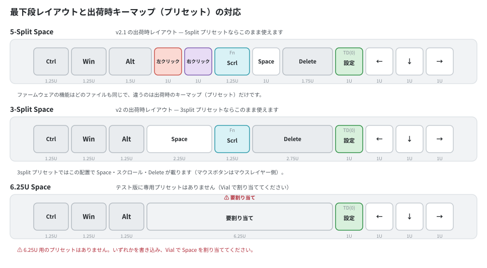
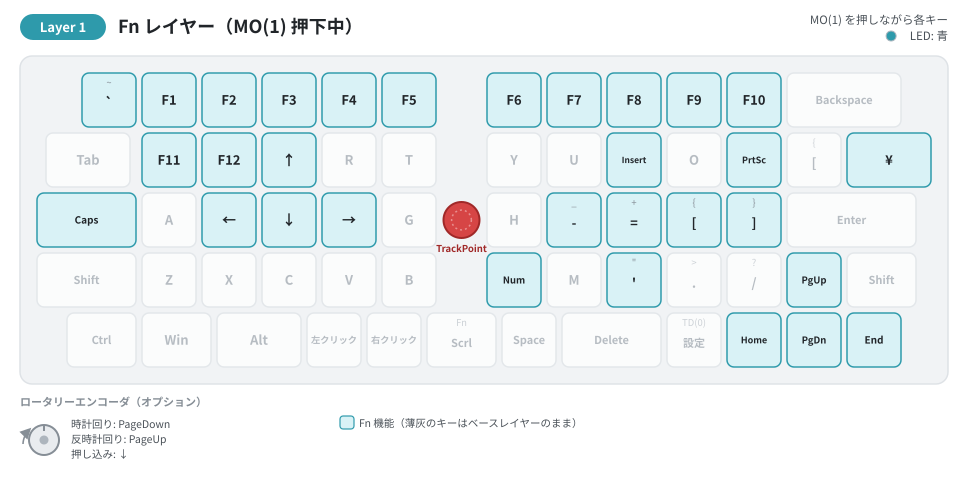
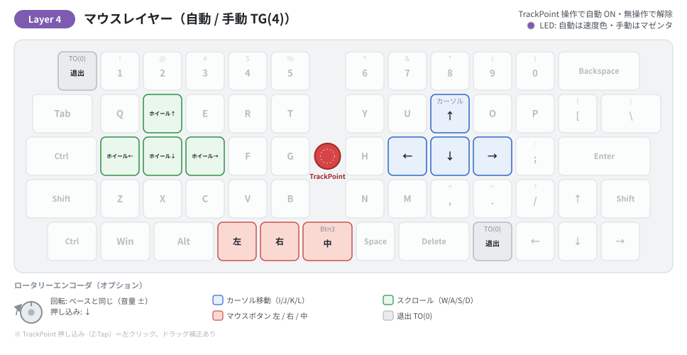
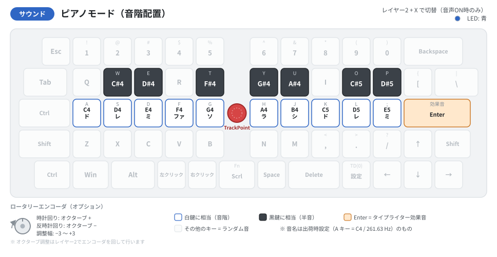

# OLSK60 キーボード操作ガイド

このドキュメントは、OLSK60 v2 シリーズ（v2 / v2.1）の操作方法を総合的にまとめたものです。  
トラックポイントの詳細な速度設定については、[マウス機能操作マニュアル](OLSK60_mouse_manual.md)もあわせてご参照ください。

> **本書が前提とするファームウェア:** 本書は**ファームウェア v3.0.0 以降**の出荷時キーマップを説明しています。旧版（v2.x）をお使いの方は、[v2.0.3 時点の説明](https://github.com/techmech-keeb/OLSK60_v2/tree/v2.0.3)をご覧ください。入手と書き込みは [firmware/README.md](../firmware/README.md) をご参照ください。
>
> 旧版（v2.x）からの主な違い: **設定ツールは Vial のみ**（Remap / VIA 非対応）、**スペース列ごとに出荷時キーマップ（プリセット）を用意**、**同時に押せるキーは 6 キーまで**。

---

## クイックスタート

OLSK60 v2 を初めて使う方は、まずこのセクションをお読みください。

1. **接続:** USBケーブル（Type-C）でPCに接続します。LEDが白く点灯すれば正常です。
2. **基本入力:** レイヤー0（基本レイヤー）で通常のキー入力ができます。
3. **ファンクションキー:** 最下段の **Scrl キー**（左親指・Fn 兼用）を押しながら数字キーを押すと、F1〜F10 が入力できます。
4. **マウス操作:** トラックポイントを指先で軽く押してカーソルを移動。最下段のマウスボタンでクリックできます。
5. **スクロール:** 最下段の **Scrl キー**（左親指・Fn と兼用）を押しながらトラックポイントを動かすとスクロールになります。
6. **設定変更:** 最下段の**設定キー**（Delete の右）を押しながら操作すると、トラックポイント速度や音声などの設定を変更できます。

---

## 目次

1. [はじめに](#はじめに)
2. [レイヤー構成の全体像](#レイヤー構成の全体像)
3. [レイヤー0：基本レイヤー](#レイヤー0基本レイヤー)
4. [レイヤー1：Fnレイヤー](#レイヤー1fnレイヤー)
5. [レイヤー2：設定レイヤー](#レイヤー2設定レイヤー)
6. [レイヤー3：予備レイヤー](#レイヤー3予備レイヤー)
7. [レイヤー4：マウスレイヤー](#レイヤー4マウスレイヤー)
8. [トラックポイントの基本操作](#トラックポイントの基本操作)
9. [オートレイヤー機能](#オートレイヤー機能)
10. [音声フィードバック機能](#音声フィードバック機能)
11. [ロータリーエンコーダ](#ロータリーエンコーダ)
12. [LEDインジケーター](#ledインジケーター)
13. [キーマップのカスタマイズ](#キーマップのカスタマイズ)
14. [特殊操作](#特殊操作)
15. [トラブルシューティング](#トラブルシューティング)

---

## はじめに

### キーボードの接続

1. USBケーブル（Type-C）をキーボードに接続します。
2. コンピューターのUSBポートに接続します。
3. キーボードが自動的に認識され、LEDが白く点灯すれば正常です。

### キーボードの基本構成

OLSK60 v2 は直交配列（格子配列）の60%キーボードです。

- 60キーの直交配列
- トラックポイントを中央に搭載
- 5つのレイヤーによるキーマップ切り替え
- ロータリーエンコーダ（オプション）
- LEDインジケーター（1個）

### ファームウェアと設定ツール

キーマップの編集には **Vial** を使います（詳しくは[キーマップのカスタマイズ](#キーマップのカスタマイズ)を参照）。ファームウェアの選び方・書き込み手順は [firmware/README.md](../firmware/README.md) をご参照ください。

---

## レイヤー構成の全体像

OLSK60 は 5 つのレイヤーを持ち、それぞれ異なる役割を担っています。

| レイヤー | 名称 | 切り替え方法 | LED色 |
|----------|------|-------------|-------|
| レイヤー0 | 基本レイヤー | 常時有効（ベース） | 白（暗め） |
| レイヤー1 | Fnレイヤー | Scrl キー（左親指）を押している間 | 青 |
| レイヤー2 | 設定レイヤー | 設定キー（Delete の右）を押している間 | 橙（値の調整中は対象の色で速く明滅） |
| レイヤー3 | 予備レイヤー | 設定キーを短くタップしてから押し続けている間（初期状態は空き） | シアン |
| レイヤー4 | マウスレイヤー | トラックポイント操作時に自動、またはレイヤー2の「.」キー（TG(4)）で手動 | 自動時は速度プロファイルの色でゆっくり明滅、手動時はマゼンタ（赤紫）で点灯 |

レイヤーは番号が大きいほど優先されます。レイヤー0は常にベースとして機能し、他のレイヤーがオフの場合に使用されます。

### レイヤーの切り替え方式

OLSK60 では**モーメンタリー方式（MO）**を採用しています。キーを押している間だけレイヤーが有効になり、離すと元のレイヤーに戻ります。レイヤー4（マウスレイヤー）だけは例外で、トラックポイント操作で自動的に有効になり、操作をやめると設定時間後に解除されます（レイヤー2の「.」キーで手動 ON/OFF も可能）。

---

## レイヤー0：基本レイヤー

レイヤー0は通常の入力に使用する基本レイヤーです。標準的な60%キーボードに近い配置を直交配列で実現しています。

### 最上段

| 位置 | キー |
|------|------|
| 左端 | Esc |
| 数字列 | 1～0 |
| 右端 | Backspace（2U） |

### 2段目

| 位置 | キー |
|------|------|
| 左端 | Tab（1.5U） |
| 文字列 | Q W E R T ／ Y U I O P [ |
| 右端 | \（1.5U） |

### 3段目

| 位置 | キー |
|------|------|
| 左端 | Ctrl（1.75U） |
| 文字列 | A S D F G ／ H J K L ; |
| 右端 | Enter（2.25U） |

### 4段目

| 位置 | キー |
|------|------|
| 左端 | Shift（1.75U） |
| 文字列 | Z X C V B ／ N M , . / |
| 右端 | ↑, Shift（1.25U） |

### 最下段（5-Split-Spaceレイアウトの場合）

> **注意:** 以下の最下段配列は、v2.1の出荷時（デフォルト）レイアウトである 5-Split-Space 版ファームウェアの場合です。3-Split-Space 版は並びが異なります（[スペースバーのレイアウトオプション](#スペースバーのレイアウトオプション)参照）。

左から順に：

| キー | サイズ | 説明 |
|------|--------|------|
| Ctrl | 1.25U | 左Ctrl |
| Win | 1.25U | 左Win/Cmd |
| Alt | 1.5U | 左Alt |
| マウス左ボタン | 1U | 常にマウス左クリックとして動作 |
| マウス右ボタン | 1U | 常にマウス右クリックとして動作 |
| Scrl（Fn） | 1.25U | 押している間 **トラックポイントがスクロールになり、同時にレイヤー1（Fn）も有効**になります |
| Space | 1U | スペースキー |
| Delete | 1.75U | Deleteキー |
| 設定キー | 1U | 押している間レイヤー2（設定）に切り替え。短くタップしてから押し続けるとレイヤー3（予備） |
| ← | 1U | カーソルキー左 |
| ↓ | 1U | カーソルキー下 |
| → | 1U | カーソルキー右 |

**マウス左ボタン・マウス右ボタンは、レイヤーに関係なく常にマウスボタンとして動作します。** トラックポイントでカーソルを動かしながら、親指で左右クリックを行えます。

> **Scrl キーについて:** 従来の Fn キー（MO(1)）の位置が、v3 では **Scrl キー**になりました。押している間は Fn レイヤーが有効になるので **Fn の機能はそのまま使えます**。加えて、押しながらトラックポイントを動かすとスクロールになります。

### スペースバーのレイアウトオプション

**ファームウェア（v3）は、機能はどれも同じです。**配布ファイルが 2 つあるのは、**出荷時のキーマップ（プリセット）**が 2 通りあるためで、スペース列ごとに「そのまま使える」配置を用意しています。**どちらを書き込んでも動作し**、キー配置は Vial でいつでも変更できます。

| オプション | 構成 | 対応モデル | そのまま使えるプリセット |
|-----------|------|-----------|--------------------|
| 5-Split-Space | 1U、1U、1.25U、1U、1.75Uの5キー構成 | **v2.1のみ**（v2.1のデフォルト） | `..._Vial_5split.uf2` |
| 3-Split-Space | 2.25U、1.25U、2.75Uの3キー構成 | v2 / v2.1（v2のデフォルト） | `..._Vial_3split.uf2` |
| 6.25U Space | 標準的な6.25Uスペースバー | v2 / v2.1 | 専用プリセットはありません（いずれかを書き込み、Vial で割り当ててください） |

> **注意:** 5-Split-Spaceレイアウトはv2.1でのみ選択可能です。v2.1は出荷時に5-Split-Spaceで構成されています。v2の基板はこのレイアウトに対応していません。お手持ちのモデルがv2かv2.1か不明な場合は、基板上のシルク印刷をご確認ください。

以下の図は、各レイアウトオプションに出荷時キーマップのキーがどう対応するかを示しています。

> **プリセットが合っていないとどうなるか:** 例えば 3-Split のキーボードに 5-Split 用のプリセットを書き込むと、Space が**物理キーの無い位置**に載るため、そのままでは Space が打てません。壊れているわけではなく、**Vial で Space を押せる位置に割り当て直せばそのまま使えます**。手間を省きたい場合は、最初からお使いのスペース列に合うプリセットを選んでください。

> **3-Split 版のキー配置:** 最下段は左から Ctrl / Win / Alt / **Space（2.25U）** / **Scrl（1.25U）** / **Delete（2.75U）** / 設定キー / ←↓→ です。**マウス左右ボタンは最下段ではなくマウスレイヤー側**（トラックポイント操作中）に載ります。

> **設定ツールのレイアウト表示について:** Vial のレイアウトオプションは**画面に表示するキーの形**を切り替えるだけで、打鍵の割り当ては変わりません。書き込んだ直後の表示は **3-Split** です。5-Split のキーボードでは、Vial の Layout タブで 5-Split を選び直してください（表示だけの設定で、選び直した内容は保存されます）。

> 💡 各レイアウトで**どのサイズのキーキャップが何個必要か**は、ビルドガイドの[キーキャップサイズガイド](buildguide.md#31-キーキャップサイズガイド)にレイアウト別の図と数量表を用意しています。

---

## レイヤー1：Fnレイヤー

最下段の **Scrl キー**（左親指）を押している間、有効になります。ファンクションキーやカーソル移動関連のキーが配置されています。レイヤー0とレイヤー1を合わせて、概ねテンキーレスキーボード相当のキーをカバーしています。

> 図中の薄いグレーのキーはレイヤー0と同じ動作です（以降のレイヤー図も同様）。

### 主な変更点

| キー位置 | レイヤー0 | レイヤー1 |
|----------|----------|----------|
| 最上段左端 | Esc | ` (グレイヴ) |
| 数字列 | 1～0 | F1～F10 |
| Q / W | Q / W | F11 / F12 |
| E / S / D / F | 文字 | ↑ / ← / ↓ / →（カーソル） |
| I | I | Insert |
| P | P | Print Screen |
| CapsLock位置 | Ctrl | Caps Lock |
| J / K / L | 文字 | - / = / [ |
| ; | ; | ] |
| 右端（2段目） | \ | ¥ |
| ↑ / ↓ | ↑ / ↓ | Page Up / Page Down |
| ← / → | ← / → | Home / End |

---

## レイヤー2：設定レイヤー

最下段の**設定キー**（Delete の右）を押している間、有効になります。トラックポイントの速度、オートレイヤー、音声などの設定と、本体の操作（書き込みモード・再起動）を行うレイヤーです。設定キーを押したまま、各キーを押してください。

> **設定キーの 2 つの使い方:** 押し続けると設定レイヤー（LED 橙）になります。**短くタップしてから、すぐに押し続ける**と予備のレイヤー（[レイヤー3](#レイヤー3予備レイヤー)）になります。単独で押し続けたときは、LED が橙になるまでわずかに間があります（他のキーと一緒に押せば待ち時間はありません）。

### トラックポイント速度プロファイル選択（数字列）

| キー | 機能 | LED |
|------|------|-----|
| 1 | 速度1（遅い・固定） | 青が2回点滅 |
| 2 | 速度3（速い・固定）**※デフォルト** | シアンが2回点滅 |
| 3 | 速度4（調整枠） | マゼンタ（赤紫）が2回点滅 |
| 4 | 速度5（調整枠） | 橙が2回点滅 |

速度2（中間）は設定レイヤーには置いていません。使いたい場合は、Vial で独自キー「TP Spd2」（色は紫）を好きな位置に割り当ててください。プロファイルの詳細は[マウス機能操作マニュアル](OLSK60_mouse_manual.md)をご参照ください。

### 値の調整（Q / W / E / V と矢印キー）

調整したい**対象**を選んでから、**↑ / ↓** で値を増減します。対象を選ぶと、LED がその対象の色で速く明滅します。

| キー | 機能 | 明滅の色 |
|------|------|---------|
| Q | 対象を「基本速度」にする | 青 |
| W | 対象を「加速度」にする | シアン |
| E | 対象を「減速度」にする | 紫 |
| V | 対象を「オートレイヤーの解除時間」にする | 橙 |
| ← / → | 対象を順に切り替える（基本速度 → 加速度 → 減速度 → 解除時間） | 対象の色 |
| ↑ | 選んだ対象の値を 1 段上げる | 対象の色で長めに 1 回光る |
| ↓ | 選んだ対象の値を 1 段下げる | 対象の色で短く 2 回光る |

- 基本速度・加速度・減速度は、**速度4 または速度5 を選んでいるときだけ**調整できます。速度1・速度3 のときは LED が**赤く速く3回**点滅し、操作は受け付けられません。
- 上限・下限に達すると、LED が**黄色く速く3回**点滅します。
- オートレイヤーの解除時間は、どの速度プロファイルでも 10 ms 刻みで調整できます。
- 設定キーを離すと、対象は「基本速度」に戻ります。調整した値は自動で保存されます。

### オートレイヤー（Z / X / C）

| キー | 機能 | LED |
|------|------|-----|
| Z | オートレイヤー ON/OFF | ON = 緑 / OFF = 赤が2回点滅 |
| X | 解除時間を短く（150ms） | 橙が1回点滅 |
| C | 解除時間を長く（800ms）**※デフォルト** | 橙が3回点滅 |

中間の 400ms は Vial の独自キー「AL 400」で選べます。V と ↑ / ↓ を使えば 10 ms 刻みで好みの時間にできます。

### トラックポイントの切り替え（T / G）

| キー | 機能 | LED |
|------|------|-----|
| T | スクロールの効き方の切り替え。**ON**: 軽く操作したときは細かく、強く操作するほど速く進みます（出荷時）。**OFF**: 操作の強さに比例した従来の動きに戻ります | ON = 緑 / OFF = 赤が2回点滅 |
| G | トラックポイントの押し込みクリック（Depress 機能）の ON/OFF（出荷時は ON） | ON = 緑 / OFF = 赤が2回点滅 |

> ホストによってはスクロールの加速が二重にかかることがあります。速すぎると感じたら T で OFF をお試しください。

### 音声設定（A / S）

| キー | 機能 | LED |
|------|------|-----|
| A | 全音声 ON/OFF | ON = 緑 / OFF = 赤が2回点滅 |
| S | サウンドモード切替（ランダム ↔ ピアノ） | ピアノ = 青 / ランダム = 橙が2回点滅 |

### 本体の操作

| キー | 機能 | 説明 |
|------|------|------|
| 5 | 出荷時の設定に戻す | **押し続けて 2 秒**で、速度・調整枠・オートレイヤー・スクロールの効き方・押し込みクリック・音声の設定を出荷時に戻します（緑がゆっくり3回点滅）。**キー配置は変わりません。**2 秒経つ前に離すと取り消されます |
| . | マウスレイヤーの手動 ON/OFF | Vial 上の表示は `TG(4)`。キーを離したときに切り替わります（ON の間 LED はマゼンタ） |
| 9 | 設定の全消去 | 保存されているキー配置と設定をすべて消去し、工場出荷状態に戻します |
| 0 | 書き込みモード（BOOTSEL） | ファームウェア書き込み用のモードで再起動します |
| Backspace | 再起動 | キーボードを再起動します |

> ⚠️ **注意:** 9（設定の全消去）は、Vial で変更したキー配置も含めてすべて初期化します。設定だけを戻したいときは 5（出荷時の設定に戻す）を使ってください。

---

## レイヤー3：予備レイヤー

**初期状態では何も割り当てられていない、自由に使えるレイヤー**です（すべてのキーがレイヤー0と同じ動作）。Vial で好きなキーを割り当てて使います。

- **入り方:** 設定キーを**短くタップしてから押し続ける**と、押している間だけ有効になります（LED シアン）。Vial で `MO(3)` や `TG(3)` を割り当てることもできます。
- **スクロールしながら使う:** Vial の独自キー「Scrl L3」を割り当てると、押している間スクロールになり、同時にレイヤー3が有効になります。
- このレイヤーを使っている間は、オートレイヤー（マウスレイヤーへの自動切り替え）は働きません。

---

## レイヤー4：マウスレイヤー

トラックポイントの操作時に自動的に有効になるレイヤーです（オートレイヤー機能）。一番上のレイヤーなので、他のレイヤーの上に重なります。

### レイヤー0からの主な変更点

レイヤー4では、ほとんどのキーはレイヤー0と同じですが、一部が変わります。

| キー位置 | レイヤー0 | レイヤー4 |
|----------|----------|----------|
| Esc の位置 | Esc | マウスレイヤーを抜ける（TO(0)） |
| W / A / S / D | 文字 | ホイール ↑ / ← / ↓ / → |
| I / J / K / L | 文字 | カーソル ↑ / ← / ↓ / → |
| マウス左・右ボタンの位置 | マウス左・右ボタン | 同じ（左・右クリック） |
| Scrl の位置 | スクロール＋Fn | マウス中ボタン（5-Split の場合） |
| 設定キーの位置 | 設定レイヤー | マウスレイヤーを抜ける（TO(0)） |

> **3-Split 版**では最下段の並びが変わり、レイヤー4では左から **マウス左ボタン / スクロール / マウス右ボタン**になります。

**スクロールしたいとき**は、最下段の **Scrl キー**を押しながらトラックポイントを動かします（マウスレイヤーが有効かどうかに関わらず使えます）。上下だけでなく左右のスクロールもできます。

> Vial の独自キー「Scrl Ms」を割り当てると、押している間スクロールになり、同時にマウスレイヤーが有効になります（出荷時は未配置）。

---

## トラックポイントの基本操作

### カーソル移動

トラックポイントを指先で軽く押すことでカーソルを移動できます。押す力の強さに応じてカーソルの移動速度が変化します。

### マウスボタン

最下段に配置された専用キーで操作します。

| 操作 | キー | 備考 |
|------|------|------|
| 左クリック | マウス左ボタン | レイヤーに関係なく常時有効（3-Split 版はマウスレイヤー側） |
| 右クリック | マウス右ボタン | レイヤーに関係なく常時有効（3-Split 版はマウスレイヤー側） |
| スクロール | Scrl キー（最下段・左親指） | 押している間、トラックポイントの動きがスクロールになります |

### スクロール操作

最下段の **Scrl キー**を押しながらトラックポイントを動かすと、カーソル移動ではなくスクロール操作になります。押している間は Fn レイヤーも有効です。

- 上下方向：ページの縦スクロール
- 左右方向：ページの横スクロール

**v3 ではスクロールが滑らかになりました。**1 ノッチより細かい単位で送るため、ゆっくり動かしたときの追従が改善します。また、**軽く操作したときは細かく、強く操作するほど速く進む**調整が出荷時から有効です。従来の動きに戻したい場合は、レイヤー2の **T キー**で切り替えてください。

### Depress機能（トラックポイント押し下げクリック）

トラックポイントを軽く押し下げることでクリック操作が可能です。出荷時は ON です。誤ってクリックしてしまう場合は、レイヤー2の **G キー**で OFF にできます（ON = 緑 / OFF = 赤が2回点滅。設定はキーボード内に保存されます）。

---

## オートレイヤー機能

トラックポイントを操作すると、自動的にレイヤー4（マウスレイヤー）に切り替わります。マウス中ボタンなどが使えるようになり、W/A/S/D・I/J/K/L でホイールとカーソルも操作できます。

### 動作の流れ

1. トラックポイントを動かすと、レイヤー4が自動的に有効になります。
2. トラックポイントの操作を停止すると、設定した時間の経過後にレイヤー4が自動的に解除されます。
3. マウスボタンや Scrl キーを押している間は、レイヤー4が維持されます。
4. レイヤー1・レイヤー2・レイヤー3を使っている間は、自動では切り替わりません。

### 解除タイミングの調整

レイヤー2で、オートレイヤーが解除されるまでの時間を選べます。

| 操作 | 遅延時間 | LED | 用途 |
|------|---------|-----|------|
| レイヤー2 + X | 150ms | 橙が1回点滅 | キー入力を優先したい場合 |
| レイヤー2 + C（デフォルト） | 800ms | 橙が3回点滅 | マウス操作を優先したい場合 |
| レイヤー2 + V → ↑ / ↓ | 100〜2000ms（10ms 刻み） | 橙で速く明滅し、↑ で長めに 1 回 / ↓ で短く 2 回光る | 好みの時間に合わせたい場合 |

中間の 400ms は、Vial の独自キー「AL 400」を割り当てて選ぶこともできます。

### オートレイヤーの無効化

レイヤー2 + Z キーで、オートレイヤー機能自体の ON/OFF を切り替えられます。

- **ON** → 緑が2回点滅
- **OFF** → 赤が2回点滅

OFF にしても、トラックポイントのカーソル移動・マウスボタン・**Scrl キーでのスクロール**は通常どおり使えます（スクロールはマウスレイヤーに依存しません）。マウスレイヤーを手動で使いたい場合は、レイヤー2の **「.」キー（TG(4)）**で ON/OFF できます。

---

## 音声フィードバック機能

OLSK60 はキー入力時に電子音を鳴らす音声フィードバック機能を搭載しています。デフォルトではOFFになっています。

### 全音声の ON/OFF

レイヤー2 + A キーで音声機能をまとめて ON/OFF できます。

- **ON** → 緑が2回点滅
- **OFF** → 赤が2回点滅

### サウンドモード

レイヤー2 + S キーで2つのモードを切り替えられます（音声がONの場合のみ有効。OFFの場合はLEDが赤く速く3回点滅し、操作が拒否されます）。

| モード | LED色 | 説明 |
|--------|-------|------|
| ランダムモード | 橙 | キーを押すたびにランダムな電子音が鳴ります |
| ピアノモード | 青 | キーの位置に応じた音階で発音します |

### ピアノモード

ピアノモードでは、キーボードの中段を中心にピアノの鍵盤のように音階が割り当てられます。

**白鍵に相当するキー（左から）：**
A → C（ド）、S → D（レ）、D → E（ミ）、F → F（ファ）、G → G（ソ）、H → A（ラ）、J → B（シ）、K → C（ド・1オクターブ上）、L → D（レ・1オクターブ上）、; → E（ミ・1オクターブ上）

**黒鍵に相当するキー：**
W → C#、E → D#、T → F#、Y → G#、U → A#、O → C#（1オクターブ上）、P → D#（1オクターブ上）

### ピアノオクターブの調整

ロータリーエンコーダ搭載モデルでは、レイヤー2でエンコーダを回すとピアノの音域を上下にシフトできます（-3～+3オクターブ。上げる = 青が1回 / 下げる = 青が2回点滅）。ピアノモード以外では赤く速く3回点滅し、操作は受け付けられません。

### Enterキーのタイプライター音

音声がONの状態でEnterキーを押すと、タイプライター風の効果音が鳴ります。

---

## ロータリーエンコーダ

ロータリーエンコーダ搭載モデルでは、各レイヤーでエンコーダに異なる機能が割り当てられています。

| レイヤー | 時計回り | 反時計回り | 押し込み |
|----------|---------|----------|---------|
| レイヤー0 | 音量ダウン | 音量アップ | ↓ |
| レイヤー1 | Page Down | Page Up | ↓ |
| レイヤー2 | ピアノオクターブ上げ | ピアノオクターブ下げ | ↓ |
| レイヤー3 | 音量ダウン | 音量アップ | ↓ |
| レイヤー4 | 音量ダウン | 音量アップ | ↓ |

> **補足:** レイヤー0の回転方向と音量の対応は、エンコーダの取り付け向きに依存します。直感と異なる場合は、設定ツール（Vial）でキーを入れ替えて調整できます。レイヤー3とレイヤー4はレイヤー0と同じ割り当て（透過）です。

---

## LEDインジケーター

OLSK60 には1個のLEDインジケーターがあり、現在のレイヤーやトラックポイントの設定状態を色で表示します。

**色の約束:** 緑 = オン・完了、赤 = オフ・受け付けない、黄 = 上限・下限、白 = 通常の状態。この4色はその意味にだけ使い、ほかの色はレイヤーや選んでいる項目を表します。**光り方**でも区別します: 点灯 = レイヤー、ゆっくり明滅 = オートレイヤー中、速い明滅 = 設定レイヤーで値を調整中、短い点滅 = 設定を変えた合図。

### レイヤー表示

| 状態 | LED色 |
|------|-------|
| レイヤー0（通常時） | 白（暗め） |
| レイヤー1（Fn使用時 = Scrl キー押下中） | 青 |
| レイヤー2（設定キー押下中） | 橙 |
| レイヤー2で値を調整中（Q / W / E / V や矢印キーを押した後） | 選んだ対象の色で**速く**明滅（基本速度 = 青 / 加速度 = シアン / 減速度 = 紫 / 解除時間 = 橙） |
| レイヤー3（予備レイヤー） | シアン |
| レイヤー4（トラックポイント操作で自動 ON） | 速度プロファイルの色で**ゆっくり**明滅 |
| レイヤー4（「.」キーで手動 ON） | マゼンタ（赤紫）で点灯 |

### トラックポイント速度プロファイルの色

レイヤー4がトラックポイント操作で自動的に有効になっている間、選択中の速度プロファイルに応じた色でゆっくり明滅します。

| プロファイル | LED色 |
|-------------|-------|
| 速度1（遅い） | 青 |
| 速度2（中間） | 紫 |
| 速度3（速い・デフォルト） | シアン |
| 速度4（調整枠） | マゼンタ（赤紫） |
| 速度5（調整枠） | 橙 |

### 設定操作時のLEDフィードバック

| 操作 | LED表示 |
|------|--------|
| 速度プロファイル変更（1〜4） | プロファイルの色が2回点滅 |
| 値を上げる（↑） | 対象の色で長めに1回光る |
| 値を下げる（↓） | 対象の色で短く2回光る |
| 上限・下限に達した | 黄が速く3回点滅 |
| 操作を受け付けない（速度1・速度3 のときの調整、音声 OFF 中のモード切替など） | 赤が速く3回点滅 |
| 音声 ON / OFF（A） | 緑 / 赤が2回点滅 |
| サウンドモード：ピアノ / ランダム（S） | 青 / 橙が2回点滅 |
| ピアノオクターブ上げ / 下げ（エンコーダ） | 青が1回 / 2回点滅 |
| オートレイヤー ON / OFF（Z） | 緑 / 赤が2回点滅 |
| オートレイヤー解除時間 150ms / 800ms（X / C） | 橙が1回 / 3回点滅 |
| スクロールの効き方 ON / OFF（T） | 緑 / 赤が2回点滅 |
| 押し込みクリック ON / OFF（G） | 緑 / 赤が2回点滅 |
| 出荷時の設定に戻した（5 を 2 秒） | 緑がゆっくり3回点滅 |

> 最下段の Scrl キー自体は LED を光らせません（押している間スクロールになるだけです）。Q / W / E / V と ← / → も点滅はせず、明滅の色が切り替わるだけです。

---

## キーマップのカスタマイズ

キーマップは **Vial** で編集できます。**Remap / VIA には対応していません。**

### 対応する設定ツール

| ツール | 概要 | リンク |
|--------|------|--------|
| **Vial** | VIA系から派生したオープンソースの編集ツール。キーボード定義をファームウェアに内蔵するため、定義ファイルの読み込みは不要です。 | <https://get.vial.today/> |
| **Pipette** | Vial互換キーボード向けの設定アプリ（Windows / macOS / Linux）。Vial 公式アプリでロータリーエンコーダ周りの表示に不具合が出る場合はこちらをお試しください。 | <https://github.com/darakuneko/pipette-desktop> |

> **トラックポイント速度・オートレイヤー・スクロールなどの専用キー**は、Vial のキーコード一覧に独自キーとして並んでいます。好きな位置に割り当て直せます。

### Vial のアンロック操作

Vial / Pipette で一部の設定（マトリクステスター等）を使う際、キーボードのアンロックを求められることがあります。画面の指示に従い、**Esc キーと Enter キーを同時に長押し**してください。

### Vial での基本的な使い方

1. [Vial](https://get.vial.today/) を起動し、キーボードを USB で接続します。
2. キーマップが表示されたら、変更したいキーをクリックして、下の一覧から新しいキーを選びます。
3. 変更はその場でキーボードに保存されます（書き込み操作は不要です）。
4. 元に戻したいときは、レイヤー2の 9（設定の全消去）で出荷時のキーマップに戻せます（設定も初期化されます）。

> **ファームウェアを書き込み直すと、Vial で変更した内容は初期化されます。**v3.0.0-rc.4 以降どうしの書き込みなら、書き込む前に `Save Current Layout` で保存し、書き込み後に `Load Saved Layout` で読み込み直せます。
>
> ⚠️ **旧版（v2.x）と、v3.0.0-rc.3 以前のテスト版で保存した `.vil` は読み込まないでください。** 独自キーの並びが変わっているため、別の機能が割り当てられます（Vial は保存元のキーボードを確認しません）。これらから移行する場合は組み直してください。

### カスタマイズ可能な項目

- 各レイヤーのキーマップ変更
- 独自キー（トラックポイント速度設定、音声設定、スクロール等）の配置変更
- 予備レイヤー（レイヤー3）へのキーの割り当て
- マクロの設定

> スペース列（5-Split / 3-Split）ごとの**出荷時キーマップ（プリセット）**は書き込むファイルで決まります。設定ツール側のレイアウト選択は画面表示だけで、打鍵の割り当ては変わりません（割り当ては Vial のキーマップ編集で変更します）。

### マトリクステスター

Vial にはマトリクステスター機能があり、すべてのキーが正しく動作するかを確認できます。キースイッチ取り付け後の動作確認にご活用ください。

---

## 特殊操作

### 出荷時の設定に戻す（キー配置はそのまま）

レイヤー2の **5 を押し続けて 2 秒**経つと、緑がゆっくり3回点滅し、次の設定が出荷時の状態に戻ります。キー配置（Vial で変更した内容）は変わりません。2 秒経つ前に離すと取り消されます。

- トラックポイントの速度プロファイル（速度3）と調整枠（速度4・速度5）の値
- オートレイヤーの ON/OFF と解除時間
- スクロールの効き方（T キーの設定）
- 押し込みクリック（G キーの設定）
- 音声機能の設定

### 設定の全消去（工場出荷状態へ戻す）

レイヤー2の **9** を押すと、保存されている設定とキー配置がすべて消去され、工場出荷状態に戻ります。

**リセットされる項目：**
- 上の「出荷時の設定に戻す」の項目すべて
- 設定ツールで変更したキーマップ

### キーボードの再起動

レイヤー2の右上端キー（Backspace位置）を押すと、キーボードが再起動します。設定は保持されます。

### ブートローダーモード（ファームウェア書き込み用）

ESCキーを押しながらUSBケーブルを接続すると、ブートローダーモードで起動します。ファームウェアの更新時に使用します。**ファームウェアが起動しない状態でもこの方法で書き込みモードに入れます。** キーボードが正常に動いているときは、レイヤー2の **0** のキー（BOOTSEL）でも同じモードに入れます。詳しくは [firmware/README.md](../firmware/README.md) をご参照ください。

---

## トラブルシューティング

| 症状 | 対処方法 |
|------|----------|
| キーボードが認識されない | 1. USBケーブルを抜き差し → 2. 別のUSBポートを試す → 3. 別のケーブルを試す |
| 特定のキーが反応しない | 1. Vial のマトリクステスターで確認 → 2. キースイッチを挿し直す → 3. スイッチのピンが曲がっていないか確認 |
| トラックポイントが動かない | 1. ケーブルを抜き差しして再起動 → 2. フラットケーブルの接続を確認（[ビルドガイド](buildguide.md)参照） |
| LEDが点灯しない | 1. USBケーブルを抜き差し → 2. ファームウェアの再書き込みを試す |
| カスタム設定がリセットされてしまう | 設定の全消去（レイヤー2 + 9）や出荷時に戻す（レイヤー2 + 5 の長押し）を誤って押していないか確認。なお**ファームウェアを書き込み直すと設定は初期化されます** |
| トラックポイントの速度が合わない・反応が弱い | レイヤー2で速度プロファイルを変更。それでも遅い場合は速度5を選び、基本速度を上げてください。詳細は[マウス機能操作マニュアル](OLSK60_mouse_manual.md)参照 |
| 音が鳴らない | レイヤー2 + A で音声機能がONか確認（緑2回点滅 = ON） |
| スクロールが効かない | 最下段の **Scrl キー**（左親指）を押しながらトラックポイントを操作しているか確認。スクロールはマウスレイヤーの有無に関係なく使えます |
| キーマップがおかしい | Vial に接続してキーマップを確認。必要に応じてレイヤー2 + 9 で設定の全消去（工場出荷状態へ） |
| 押し込んでいないのにクリックされる | レイヤー2 + G で押し込みクリックを OFF にできます（赤2回点滅 = OFF） |
| 設定キーを押すと LED がシアンになる | 設定キーを短く押してから押し続けると、予備のレイヤー3に入ります。一度離して、押し続け直してください |
| Space が入力できない | **プリセットとトッププレートが合っていない**可能性があります。合うプリセット（3 分割なら `3split`）を書き込み直すか、Vial で押せる位置に Space を割り当て直してください（[スペースバーのレイアウトオプション](#スペースバーのレイアウトオプション)参照） |

そのほかのよくある質問は [FAQ](faq.md) にまとめています。

---

## 注意事項

- キーボードの清掃は定期的に行ってください。
- 強い衝撃を与えないように注意してください。
- 水気のある場所での使用は避けてください。
- トラックポイントの操作は軽い力で行ってください。無理な力を加えると破損の原因になります。

---

## サポート

ご不明点があれば [BOOTHの商品ページ](https://techmech.booth.pm/items/5896343) または [GitHub Issue](https://github.com/techmech-keeb/OLSK60_v2/issues) にてご連絡ください。
