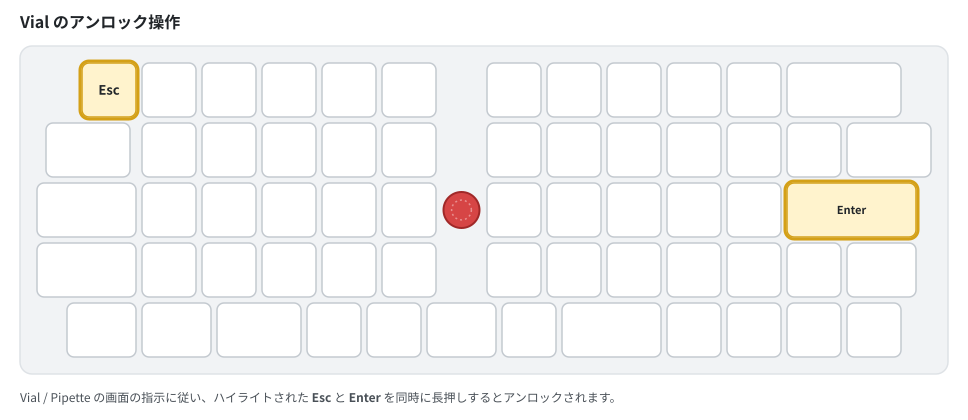

# OLSK60 よくある質問（FAQ）

OLSK60 v2 シリーズについて、お問い合わせの多い項目をまとめています。  
記載のない症状は[操作ガイドのトラブルシューティング](OLSK60_user_guide.md#トラブルシューティング)もご確認ください。

---

## モデル・ファームウェアの選択

### Q. 自分の個体が v2 か v2.1 か分かりません

基板上のシルク印刷（バージョン表記）をご確認ください。また、最下段が5つの小さいキーに分かれたトッププレート（5-Split Space）が付いている個体は v2.1 です。v2 の基板は 5-Split Space に対応していません。

### Q. ファームウェアは更新しないとダメですか？

いいえ、必須ではありません。**2026年6月までにご購入の個体は旧版ファームウェアのまま Remap でご利用いただけます**（当面 Remap 用の設定を維持します）。VIA や Vial を使いたい場合、または最新の機能改善を利用したい場合にのみ更新してください。手順は [firmware/README.md](../firmware/README.md) をご参照ください。

### Q. VIA と Vial のどちらを選べばよいですか？

どちらでもお使いいただけます。目安は次のとおりです。

| 選び方 | おすすめ |
|--------|---------|
| Webブラウザで手軽に使いたい | VIA（+ 定義ファイル読み込み） |
| 定義ファイルの管理をしたくない / マクロやタップダンスを使いたい | Vial（**Pipette 推奨**） |

---

## 設定ツール

### Q. VIA でキーボードが認識されません

VIA 用ファームウェアではキーボード定義ファイル `olsk60_via.json`（[GitHub Releases](https://github.com/techmech-keeb/OLSK60_v2/releases) で配布）の読み込みが必要です。VIA の Settings で「Show Design tab」を有効にし、Design タブから JSON を読み込んでください。

### Q. Vial 公式アプリでロータリーエンコーダが表示されません

Vial 公式アプリの既知の不具合です。Vial 互換の設定アプリ [Pipette](https://github.com/darakuneko/pipette-desktop) では正しく表示されるため、Pipette のご利用を推奨します。

### Q. Vial / Pipette で「アンロックしてください」と表示されます

マトリクステスターなど一部機能の利用時に、誤操作防止のためアンロックが求められます。画面の指示に従い、**Esc キーと Enter キーを同時に長押し**してください。

---

## キーマップ・レイアウト

### Q. 3-Split / 6.25U レイアウトに変えたら Space が入力できなくなりました

出荷時キーマップは 5-Split Space 用に構成されているため、レイアウトオプションを切り替えただけでは Space がありません。設定ツールで大きいキー（3-Split の 2.25U、6.25U Space の 6.25U）に Space を割り当ててください。詳しくは[操作ガイドのレイアウトオプション](OLSK60_user_guide.md#スペースバーのレイアウトオプション)をご参照ください。

### Q. キーマップを出荷時の状態に戻したい

レイヤー2（MO(2) を押しながら）の左上端キー（Esc 位置）で EEPROM 消去を実行してください。キーマップを含むすべての設定が工場出荷状態に戻ります。

---

## トラックポイント

### Q. ファームウェアを書き込んだ直後、トラックポイントの押し下げクリックが効きません

既知の動作です。ファームウェア書き込み直後は押し下げクリック（Depress機能）が動作しないことがあります。**USB ケーブルを一度抜き、挿し直して再起動**すると有効になります。

### Q. カーソルの速度を変えたい

レイヤー2 + 数字キー 1〜5 で速度プロファイルを切り替えられます。さらに細かく調整したい場合は[マウス機能操作マニュアル](OLSK60_mouse_manual.md)をご参照ください。

---

## 音・LED

### Q. 音が鳴りません / 音を消したい

打鍵音はデフォルトで OFF です。レイヤー2 + Z キーで ON/OFF を切り替えられます（ON: 緑2回点滅、OFF: 赤2回点滅）。

### Q. LED の色は何を表していますか？

現在のレイヤーとトラックポイント設定の状態を表します。[操作ガイドの LED インジケーター](OLSK60_user_guide.md#ledインジケーター)に一覧があります。

---

## ファームウェア書き込み

### Q. ブートローダーモードに入れません

1. キーボードを PC から外します。
2. **Esc キーを押しながら** USB ケーブルを接続します。
3. PC に「RPI-RP2」という名前のドライブが表示されれば成功です。

表示されない場合は、別の USB ポート・ケーブルをお試しください。詳しくは [firmware/README.md](../firmware/README.md) をご参照ください。

---

## サポート

解決しない場合は [BOOTHの商品ページ](https://techmech.booth.pm/items/5896343) または [GitHub Issue](https://github.com/techmech-keeb/OLSK60_v2/issues) にてご連絡ください。
