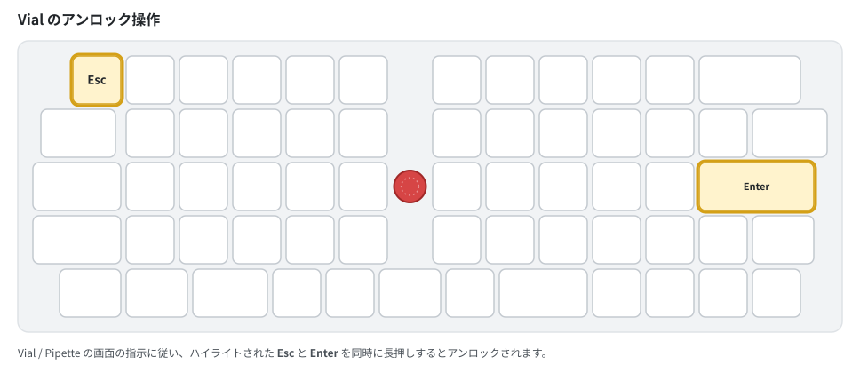

# OLSK60 よくある質問（FAQ）

OLSK60 v2 シリーズについて、お問い合わせの多い項目をまとめています。  
記載のない症状は[操作ガイドのトラブルシューティング](OLSK60_user_guide.md#トラブルシューティング)もご確認ください。

> **本書が前提とするファームウェア:** **テスト版（リリース候補）**です。正式配布版をお使いの方は通常版のドキュメントをご覧ください。

---

## モデル・ファームウェアの選択

### Q. 自分の個体が v2 か v2.1 か分かりません

基板上のシルク印刷（バージョン表記）をご確認ください。また、最下段が5つの小さいキーに分かれたトッププレート（5-Split Space）が付いている個体は v2.1 です。v2 の基板は 5-Split Space に対応していません。

### Q. テスト版に更新しないとダメですか？

いいえ。テスト版は**動作を試してご報告いただける方向け**の公開です。通常のご利用で問題がなければ、更新は不要です。手順は [firmware/README.md](../firmware/README.md) をご参照ください。

### Q. どのファイルを書き込めばよいですか？

**機能はどちらも同じ**で、違うのは**出荷時のキーマップ（プリセット）**だけです。お使いのトッププレートのスペース列に合うものを選ぶと、書き込んだあと**調整なしでそのまま使えます**。

| スペース列 | そのまま使えるプリセット |
|-----------|--------------------|
| 5 分割（v2.1 の出荷時） | `..._Vial_5split.uf2` |
| 3 分割 | `..._Vial_3split.uf2` |
| 6.25U | 専用プリセットはありません（いずれかを書き込み、Vial で割り当ててください） |

**どちらを書き込んでも動作します。**合わないプリセットのままだと Space などが押せない位置に載るので、その場合は Vial で割り当て直してください。

書き込んだ直後の Vial の Layout タブは **3-Split** 表示です。5-Split のキーボードでは「5-Split Space」を選び直してください（表示だけの設定です）。

### Q. Remap や VIA は使えますか？

テスト版は **Vial 専用**です。Remap / VIA には対応していません。

---

## 設定ツール

### Q. Vial でキーボードが認識されません

USB ケーブルがデータ通信に対応しているか、別のポートで試せるかをご確認ください。テスト版は定義をファームウェアに内蔵しているので、定義ファイルの読み込みは不要です。

### Q. Vial 公式アプリでロータリーエンコーダが表示されません

Vial 公式アプリの既知の不具合です。Vial 互換の設定アプリ [Pipette](https://github.com/darakuneko/pipette-desktop) では正しく表示されるため、Pipette のご利用を推奨します。

### Q. Vial / Pipette で「アンロックしてください」と表示されます

マトリクステスターなど一部機能の利用時に、誤操作防止のためアンロックが求められます。画面の指示に従い、**Esc キーと Enter キーを同時に長押し**してください。

---

## キーマップ・レイアウト

### Q. Space が入力できません

**書き込んだプリセットとトッププレートが合っていない**可能性が高いです。Space が物理キーの無い位置に載っている状態で、故障ではありません。次のどちらかで直ります。

1. お使いのスペース列に合うプリセット（3 分割なら `3split`）を書き込み直す。
2. Vial で、押せる位置のキーに Space を割り当て直す。

詳しくは[操作ガイドのレイアウトオプション](OLSK60_user_guide.md#スペースバーのレイアウトオプション)をご参照ください。

### Q. 左親指のキーが Fn ではなく「Scrl」になっています

テスト版では、従来 Fn（MO(1)）だった左親指のキーが **Scrl キー**になりました。押している間は **Fn レイヤーがそのまま使えます**。加えて、押しながらトラックポイントを動かすとスクロールになります。

### Q. 旧版で保存したキーマップ（`.vil`）を読み込んでも大丈夫ですか？

**旧版（v2.x）と、v3.0.0-rc.3 以前のテスト版で保存したファイルは読み込まないでください。** 独自キー（トラックポイントの速度・サウンド・オートレイヤーなど）の並びが変わっており、読み込むと**別の機能が割り当てられます**。Vial は保存元のキーボードを確認しないため、そのまま書き込まれてしまいます。お手数ですが Vial で組み直してください。

v3.0.0-rc.4 以降どうし（例: 今後のテスト版や正式版への更新）であれば、`Save Current Layout` → `Load Saved Layout` で問題なく戻せます。

### Q. キーマップを出荷時の状態に戻したい

レイヤー2（最下段の設定キーを押しながら）で **9** を押すと、設定の全消去を実行します。キーマップを含むすべての設定が工場出荷状態に戻ります。**ファームウェアを書き込み直したときも初期化されます。**

キーマップはそのままで、トラックポイントやオートレイヤーなどの設定だけを戻したい場合は、レイヤー2で **5 を 2 秒押し続けて**ください（緑がゆっくり3回点滅）。

### Q. 設定レイヤーに入るキーはどれですか？

最下段の **Delete の右のキー（設定キー）**です。押している間は設定レイヤー（LED 橙）になります。**短くタップしてから押し続ける**と、自由に使える予備のレイヤー3（LED シアン）に入ります。設定レイヤーに入ったつもりで LED がシアンになったときは、一度離してから押し続け直してください。

---

## トラックポイント

### Q. ファームウェアを書き込んだ直後、トラックポイントの押し下げクリックが効きません

正式配布版での既知の動作です。**テスト版でも同じ症状が出るかは未確認**ですが、押し下げクリック（Depress機能）が効かないときは、まずレイヤー2 + **G** で押し込みクリックが ON になっているか確認してください（緑2回点滅 = ON）。それでも効かない場合は **USB ケーブルを一度抜き、挿し直して再起動**してみてください。改善しない場合は [Issues](https://github.com/techmech-keeb/OLSK60_v2/issues) へご報告いただけると助かります。

### Q. カーソルの速度を変えたい

レイヤー2 + 数字キー 1〜4 で速度プロファイル（速度1 / 速度3 / 速度4 / 速度5）を切り替えられます。さらに細かく調整したい場合は[マウス機能操作マニュアル](OLSK60_mouse_manual.md)をご参照ください。

### Q. トラックポイントの反応が弱い・速度を最大にしても遅いです

レイヤー2で **4**（速度5）を選び、**Q** を押してから **↑** を押すたびに基本速度が上がります。上限に達すると黄色く3回点滅します。速度を上げるほど、ゆっくり動かしたときの最小の移動量も大きくなる点にご注意ください。改善しない場合は [Issues](https://github.com/techmech-keeb/OLSK60_v2/issues) へご報告いただけると助かります。

### Q. 押し込んでいないのにクリックされてしまいます

トラックポイントの押し込みクリック（Depress機能）は、レイヤー2 + **G** で OFF にできます（赤2回点滅 = OFF）。設定はキーボード内に保存されます。

### Q. スクロールの効きが強すぎます / 弱すぎます

テスト版のスクロールは、**強く操作するほど速く進む**調整が出荷時から有効です。レイヤー2 + **T** で従来の動きに戻せます（緑2回点滅 = 有効、赤2回点滅 = 従来どおり）。

### Q. 同時に押せるキー数は？

**6 キーまで**です（標準的な USB キーボードと同じ）。

---

## 音・LED

### Q. 音が鳴りません / 音を消したい

打鍵音はデフォルトで OFF です。レイヤー2 + A キーで ON/OFF を切り替えられます（ON: 緑2回点滅、OFF: 赤2回点滅）。

### Q. LED の色は何を表していますか？

現在のレイヤーとトラックポイント設定の状態を表します。緑 = オン・完了、赤 = オフ・受け付けない、黄 = 上限・下限が共通の約束です。[操作ガイドの LED インジケーター](OLSK60_user_guide.md#ledインジケーター)に一覧があります。

---

## ファームウェア書き込み

### Q. ブートローダーモードに入れません

1. キーボードを PC から外します。
2. **Esc キーを押しながら** USB ケーブルを接続します。
3. PC に「RPI-RP2」という名前のドライブが表示されれば成功です。

表示されない場合は、別の USB ポート・ケーブルをお試しください。詳しくは [firmware/README.md](../firmware/README.md) をご参照ください。

---

## サポート

解決しない場合は [BOOTHの商品ページ](https://techmech.booth.pm/items/5896343) または [GitHub Issue](https://github.com/techmech-keeb/OLSK60_v2/issues) にてご連絡ください。
